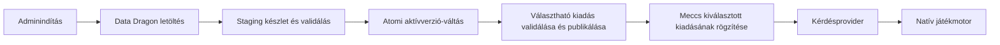

# League of Legends hősadatok — PostgreSQL-import terve

Tervezési dátum: 2026-10-10. Státusz: megvalósítás előtti terv.

Kapcsolódik a [backend kérdésprovideréhez](backend-controller.md), az
[adatbázis-útmutatóhoz](database-guide.md) és a [megvalósítási tervhez](implementation-plan.md).
Ez a dokumentum az adatimportot és az adminfrissítést tervezi át; nem migráció
és nem elkészült importáló. A kérdéssablonok és a seed/generátor részletes
szerződését a [kérdésgenerálási terv](question-generation.md) egyezteti;
az még nem véglegesített implementációs szerződés.
Az új hősadatminták [mezőszintű forrásszerződése](lol-source-schema.md)
rögzíti a ténylegesen megfigyelt JSON-mezőket és a további ellenőrzéseket.
A [seed- és kiadásválasztási terv](question-seed-version.md) az adatverziót
a változatlan sablon-/generátorkiadással együtt teszi választhatóvá.

## 1. Elfogadott hatókör

- PostgreSQL + Drizzle, a meglévő Express backendben.
- Az MVP-ben kizárólag kézi, adminfelületről indítható frissítés. Nincs cron,
  automatikus időközönkénti ellenőrzés vagy induláskori hálózati adatfrissítés.
- A forrás a csatolt programban is használt Data Dragon.
- A skinek és chromák közös adathalmazban, egymással egy szinten szerepelnek.
  A belső `is_chroma` boolean azt jelzi, hogy az adott elem chroma-e; a chromarekord
  tartalmazza a hozzá tartozó skin hivatkozását. Ezt közös táblában, `is_chroma`
  jelöléssel és `parent_skin_id` kapcsolattal őrizzük meg. A színek részletes
  feldolgozása későbbi bővítés.
- A képességek `damage` mezője az MVP-ben üres objektum (`{}`) marad.
  A sebzésadatok feldolgozása külön, későbbi feladat.
- A generátor skindarabszáma az alapkinézetet és a chromákat kihagyja;
  a chromák külön számolandók. A jelölések mindkét lekérdezést támogatják.
- A cooldown-összehasonlítás a képesség első rangjának alap cooldownját használja,
  tárgyak és rúnák nélkül. Ehhez a megjelenítési szöveg mellett külön validált
  numerikus tény szükséges.
- Az MVP adatnyelve `en_US`; a verziózott készletben külön locale mező készíti
  elő a későbbi nyelveket. A rendszerüzenetek továbbra is fordítható kódok.
- Egy meccs egyetlen, rögzített adatkészletből kapja az összes forduló kérdését.
- A várószobában a már tárolt, játszható kiadások közül lehet választani;
  az alapérték a legfrissebb. Az azonos patchhez tartozó tartalmi javítás
  külön kiadást kap, a régi adatok és generálási szabályok megmaradnak.

## 2. A csatolt programból megtartott és módosított részek

Az `update.ts` folyamata továbbra is felismerhető: elérhető verzió keresése,
hőslista letöltése, hősönkénti részletes letöltés, átalakítás, mentés.

| Korábbi rész                    | Új szerep                                                                           |
| ------------------------------- | ----------------------------------------------------------------------------------- |
| Firebase `onCall` belépési pont | Adminjogosultságot ellenőrző Express HTTP-végpont.                                  |
| `getLatestVersion`              | Data Dragon elérhető kiadásának keresése, futásidőben validált verzióválasszal.     |
| `getChampions`                  | Az adott kiadás teljes hőslistája, azonosítókkal és elvárt darabszámmal.            |
| `updateChampions`               | Határolt párhuzamosságú letöltés, validálás és PostgreSQL-re alkalmas normalizálás. |
| Firebase `.set()` hívások       | Új, elkülönített adatkészlet építése és rövid, atomi publikálási tranzakció.        |
| `UpdateError`                   | Stabil hibakód, importfutás-státusz és angol adminfelületi fordítás.                |

A régi kódban a patch és az utolsó frissítés időpontja a tartalomtáblák előtt
frissül. Egy későbbi mentési hiba emiatt késznek látszó, részleges állapotot
hagyhat. Az új tervben az aktív készlet az utolsó lépésig változatlan.

A Firebase-belépési pont bármely azonosított felhasználót átenged. Az új
HTTP-végpontnál érvényes bejelentkezés és külön adminjogosultság kell.

A `ChampionData` TypeScript-típus önmagában nem validálja a hálózati JSON-t.
Az adapter `unknown` bemenetet ellenőriz a már meglévő Zoddal; nincs típusra
kényszerítéssel vagy hiányzó mezők nullával pótlásával történő elfogadás.

## 3. Adatforrás és adatminőség

Az adapter a verziólista lekérése után konkrét verziót használ minden további
URL-ben. Nem oldja fel újra a legfrissebb kiadást minden egyes hősnél.
A Data Dragon kiadási verziója nem azonos automatikusan a játék minden
régiójának aktuális kliensverziójával; az admin ezt adatforrás-verzióként látja.

A skin és a chroma ugyanannak a belső listának kétféle eleme. Az `is_chroma`
az elem típusát jelöli, és chrománál szülőskin-hivatkozás tartozik hozzá.
A név és a külső azonosító mindkét elemtípusnál megmarad.

Az új [Aatrox-minta](lol-source-schema.md) a forrásboolean eltérő jelentését
mutatja: a Mecha Aatrox skinnél `chromas = true`, a hozzá tartozó Obsidian
rekordnál `chromas = false` és `parentSkin = 2`. A `chromas` forrásmező
emiatt nem másolható a normalizált `is_chroma` mezőbe.
A felhasználó által elfogadott leképezés szerint a `parentSkin` jelenléte
azonosítja a chromát, a boolean a forrás skinhez tartozó chromaállítását őrzi meg.
Az Aatrox-minta megadott forrása a [16.20.1-es Data Dragon-hősrészlet](https://ddragon.leagueoflegends.com/cdn/16.20.1/data/en_US/champion/Aatrox.json),
közvetlen válaszként; az MVP-adapter ebből a végpontcsaládból dolgozik.
Az elfogadott közös rekordmodellt az adapter határán állítjuk elő.

A korábbi `parentSkin` a szülő `num` értékére utal. A normalizáló először
összegyűjti a rekordokat, majd feloldja a hősön belüli szülőhivatkozásokat:
a chroma a szülője előtt is érkezhet. A `parentSkin = 0` érvényes hivatkozás,
nem hiányzó érték; a régi `if (skin.parentSkin)` igazságérték-vizsgálatot
nem vesszük át. A chromajelölés és a szülőkapcsolat összhangját külön
validáljuk, a hiányzó vagy hibás szülőt nem helyettesítjük találgatással.

A `spells.damage` a régi átalakításban mindig üres objektum, és az új modellben
is `{}` marad az MVP során. Nem tekinthető nulla sebzésnek vagy használható
sebzésadatnak. A `cooldownBurn`, `costBurn`
és `rangeBurn` megjelenítési szövegként marad meg: a rangonként eltérő érték,
speciális költség vagy globális hatótáv nem alakítható általánosan egy számmá.
Az `effectBurn` és az esetleges további effekt-/változóadat a nyers forrásban
megmarad; jelentése későbbi, képességenként ellenőrzött feldolgozás tárgya.

A hősstatisztikák alapértékek és szintenkénti növekedések. Egy későbbi kérdés
ne kezelje automatikusan az alapadatot felszereléssel módosított vagy adott
szintű játékbeli értéknek. A magasabb szintű statok és a képességsebzés
számítási szabályai nincsenek ebben a tervben véglegesítve.

## 4. PostgreSQL-táblák

A saját rekordazonosítók UUID-k. A Riot külső azonosítói külön mezők, és nem
helyettesítik az alkalmazás UUID-it. Minden hősrekord egy konkrét készlethez
tartozik; másik patch hősrekordjai külön sorok. A közös készlet és aktív
katalógus a már létező `topicId`-hoz kapcsolódik, a LoL-specifikus tartalomtáblák
külön maradnak. Így egy további játék nem igényel új meccs–adatkészlet kapcsolatot.

| Tábla                | Fő mezők és kapcsolat                                                                                                                                                                                                                                                                                     |
| -------------------- | --------------------------------------------------------------------------------------------------------------------------------------------------------------------------------------------------------------------------------------------------------------------------------------------------------- |
| `question_dataset`   | UUID `id`, `topic_id`, `source` (MVP: `ddragon`), Data Dragon `source_version`, `locale`, `normalization_version`, `content_hash`, `status` (`staging`, `ready`, `failed`), `created_at`, `completed_at`, elvárt és importált hősök száma.                                                                |
| `question_catalog`   | UUID `id`, `topic_id`, `locale`, `active_dataset_id` FK és `updated_at`. Témánként/locale-onként egyetlen aktív, kész készletre mutat.                                                                                                                                                                    |
| `lol_import_run`     | UUID `id`, `requested_by_user_id` FK, `locale`, megcélzott verzió, `dataset_id` FK, `status` (`queued`, `running`, `unchanged`, `succeeded`, `failed`, `aborted`), `stage`, feldolgozott/összes hős, időpontok, `error_code`, strukturált hibaparaméterek.                                                |
| `lol_source_payload` | UUID `id`, `dataset_id` FK, erőforráskulcs, verzióhoz kötött forrásútvonal, SHA-256, teljes eredeti JSON `jsonb` formában. A hőslista és a részletes hősök is megmaradnak.                                                                                                                                |
| `lol_champion`       | UUID `id`, `dataset_id` FK, Riot `riot_key` egész, Data Dragon `source_id` szöveg (pl. `Ahri`), `name`, `title`, ikonfájlnév, `resource_name`, normalizált `resource_type`.                                                                                                                               |
| `lol_skin`           | Közös skin/chroma tábla: UUID `id`, `champion_id` FK, Riot `source_skin_id`, `skin_num` egész, `name`, `is_chroma` boolean, nullable `parent_skin_id` önhivatkozó FK, `is_base` boolean; külön nullable `source_has_chromas` forrásflag.                                                                  |
| `lol_champion_stats` | UUID `champion_id` PK/FK, a 20 alap- és növekedési stat külön `numeric` oszlopokban. Egy hőshöz egy stats sor.                                                                                                                                                                                            |
| `lol_spell`          | UUID `id`, `champion_id` FK, Data Dragon `source_spell_id`, `slot` (`Q`, `W`, `E`, `R`), `name`, ikonfájlnév, `max_rank`, `cooldowns_by_rank` JSONB, nullable `cooldown_rank_1` numeric, `cooldown_display`, `cost_display`, `range_display`, `damage` JSONB (MVP: `{}`), külön nyers effektadat `jsonb`. |
| `lol_passive`        | UUID `champion_id` PK/FK, `name`, ikonfájlnév. Egy hőshöz egy passzív sor.                                                                                                                                                                                                                                |
| `lol_champion_tag`   | UUID `id`, `champion_id` FK, `tag` szöveg. A forrás szerepkörei, nem automatikusan kikövetkeztetett lane/pozíció.                                                                                                                                                                                         |
| `app_admin`          | UUID `user_id` PK/FK a Better Auth `user.id` mezőjére, `granted_at`. A kliens és a profilfrissítés nem írhatja.                                                                                                                                                                                           |

Az importnaplóban a kezdeményező felhasználó törlésekor a kapcsolat `SET NULL`,
az adminjogosultság viszont a userrel együtt törlődik. A LoL-tartalom nem a
kezdeményező felhasználó tulajdona, ezért a fióktörlés nem törli az adatkészletet.

### Mezők a korábbi denormalizált modellből

| Korábbi gyűjtemény | PostgreSQL-megfelelő                                                                                              |
| ------------------ | ----------------------------------------------------------------------------------------------------------------- |
| `champions`        | `lol_champion`, a külső kulcsok és szövegek megőrzésével.                                                         |
| `skins`            | `lol_skin` sorok `is_chroma = false` jelöléssel; név és forrásazonosító megmarad.                                 |
| `chromas`          | Ugyanazon `lol_skin` tábla `is_chroma = true` sorai; név, forrásazonosító és feloldott `parent_skin_id` megmarad. |
| `stats`            | `lol_champion_stats`, tizedes értékeket megőrző oszlopokkal.                                                      |
| `spells`           | `lol_spell`, a négy slot megkülönböztetésével.                                                                    |
| `passive`          | `lol_passive`.                                                                                                    |
| `tags`             | `lol_champion_tag`; a jelenlétet egy sor jelenti, nem felesleges `true` érték.                                    |
| `title`            | Egyszer tárolva a `lol_champion.title` mezőben.                                                                   |

A 20 stat: `hp`, `hp_per_level`, `mp`, `mp_per_level`, `move_speed`, `armor`,
`armor_per_level`, `magic_resist`, `magic_resist_per_level`, `attack_range`,
`hp_regen`, `hp_regen_per_level`, `mp_regen`, `mp_regen_per_level`, `crit`,
`crit_per_level`, `attack_damage`, `attack_damage_per_level`,
`attack_speed_per_level`, `attack_speed`. A forrás `spellblock` mezője a
`magic_resist`, `spellblockperlevel` a `magic_resist_per_level` oszlopba kerül.
Hiányzó szám nem lesz 0. A numerikus tartományokat és mértékegységeket a
forrásadapter és a későbbi kérdéssablon külön ellenőrzi.

A megjelenítési szöveg, név és numerikus tény normalizált oszlopba kerül;
a változó szerkezetű forrás-/effektadat JSONB-ben marad. A kérdésgenerátor
a validált oszlopokból dolgozik, nem a tetszőleges nyers JSON-mezőkből.
Az üres `damage` objektum külön JSONB mezőben megmarad, de nem kérdésalap.
A későbbi sebzésfeldolgozás szerződése és számításai külön feladatot kapnak.

Az `is_chroma = false` és `skin_num = 0` alapmegjelenés külön jelzést kap.
Ha a forrás neve `default`,
a későbbi megjelenítés a hős nevét használhatja; az eredeti név is megmarad.
A közös táblában a chroma ugyanúgy saját rekord, mint a skin; kapcsolata
egy külön sorra mutat, nem a skinbe ágyazott objektum. Nem chroma esetén
`parent_skin_id = NULL`; chroma esetén kötelező, és ugyanannak a hősnek egy
nem chroma skinrekordjára mutat. Chroma nem lehet alapmegjelenés.
Az, hogy egy skinhez tartozik-e chroma, a gyerekrekordok létezéséből
lekérdezhető. A külön `source_has_chromas` forrásállítás a nyers boolean
megőrzése, nem a normalizált gyerekszám helyettesítője. Hiányzó forrásflagnél
NULL marad; nem tölthető ki a számított darabszám alapján.
A képességslotot a forrás ellenőrzött sorrendje adja, nem a névből találgatjuk.
Ez a forrás alap slotjait jelenti, nem minden átalakuló hős minden formájának
teljes és bizonyítottan kimerítő képességkészletét.

A [mezőszintű forrásszerződés](lol-source-schema.md) alapján a `partype`
megőrzése és besorolása biztosítja a mana/energia különválasztását.
Az első rang numerikus cooldownja a validált `cooldown` tömb első eleme.
A `cooldownBurn` továbbra is megjelenítési szöveg. A teljes feltöltött
16.20.1-es snapshot ellenőrzése elkészült, az elfogadott alanyszűréssel:
hat skin és öt hős összesített chromaszáma ismeretlen, húsz végig nullás
cooldownú képesség a cooldown-kérdésalapból kimarad. A nyers rekordok és
más metrikák megmaradnak. Hiányzó vagy nem igazolt adatból nem lesz számított 0.
A [szűrés](question-catalog-draft/source-eligibility.json) tartalmi szabály,
az importált készletből vezetendő le, és a generálási kiadás rögzíti.

### Kulcsok és indexek

- `lol_champion`: egyedi `(dataset_id, riot_key)` és `(dataset_id, source_id)`.
  Ezek egyszerre védenek duplikáció ellen és támogatják a készletenkénti olvasást.
- `lol_skin`: egyedi `(champion_id, source_skin_id)` és `(champion_id, skin_num)`.
  Egyedi `(champion_id, id)` kulcs és az erre mutató összetett
  `(champion_id, parent_skin_id)` FK tiltja a másik hőshöz vagy készlethez
  tartozó szülőt. A `(champion_id, parent_skin_id)` index támogatja a skinhez
  tartozó chromák lekérdezését. CHECK szabály köti a szülő NULL/nem NULL
  állapotát az `is_chroma` jelöléshez, és kizárja az önhivatkozást, illetve
  a chroma alapmegjelenésként jelölését. A szülő nem chroma típusát az import
  validálja a publikálás előtt; staging tartalmat csak az importáló írhat.
- `lol_spell`: egyedi `(champion_id, slot)`; a forrás spell ID-ja külön megmarad.
- `lol_champion_tag`: egyedi `(champion_id, tag)`, valamint `(tag, champion_id)`
  index a szerepkörből induló kereséshez.
- Stats/passive: a `champion_id` PK egyúttal FK és gyorsítja az 1:1 joinokat.
- Nyers payload: egyedi `(dataset_id, resource_key)`.
- Készlet: egyedi `(topic_id, source, source_version, locale, normalization_version, content_hash)`
  a véglegesített tartalomhoz; a staging sor hash-e eleinte NULL lehet.
- Import: locale-onként részleges unique index az aktív (`queued`, `running`)
  futásokra; továbbá a friss futások megjelenítéséhez időpontindex.
- Catalog: egyedi `(topic_id, locale)`. Összetett FK biztosítja, hogy a pointer és a
  célkészlet témája és locale-ja is egyezzen; a `ready` állapotot a publikáló tranzakció ellenőrzi.

Minden gyereksor közvetlen szülő-FK-ja megakadályozza a különböző készletek
hős-/skin-/képességrekordjainak keverését. Nem indexelünk előre minden statot
vagy teljes nyers JSON-t: további indexhez tényleges lekérdezés és mérés kell.

## 5. Kézi import és atomi aktiválás

1. Érvényes, megerősített Better Auth session és `app_admin` ellenőrzés.
   Meccsvisszatérési cookie vagy vendégsession nem ad adminjogosultságot.
2. Tartós importfutás létrehozása. Az HTTP-kérés `202 Accepted` választ és
   `runId`-t ad; a letöltés a háttérben halad, az oldalnak nem kell nyitva maradnia.
3. A legfrissebb elérhető Data Dragon-verzió egyszeri feloldása. Azonos aktív
   forrás-/normalizálóverziónál normál frissítés `unchanged` eredményt ad.
4. Új staging készlet és konkrét verziós hőslista letöltése/validálása.
5. Hősönkénti letöltés és normalizálás, javasolt induló limitként öt párhuzamos
   hálózati kérés. Sikeres csoportok rövid DB-tranzakciókban kerülnek stagingbe.
   Hálózati várakozás közben nincs nyitva hosszú adatbázis-tranzakció.
6. Teljességi ellenőrzés: minden listabeli hős pontosan egyszer jelen van,
   a numerikus kulcsok összetartoznak, minden kötelező mező és szülőkapcsolat
   érvényes. Minden chroma ugyanazon hős és készlet nem chroma skinjére mutat;
   nincs hiányzó szülő, chroma–chroma lánc vagy ciklus. Az elvárt hősszám a
   letöltött listából jön, nincs beégetett darabszám.
7. Stabil külső kulcsok szerint rendezett tartalomból hash és összesítés készül.
   UUID, futásazonosító és letöltési idő nem kerül a tartalomhash-be.
8. Egy rövid tranzakció zárolja a catalog sorát, a staging készletet `ready`-re
   állítja, átváltja az aktív pointert és sikeresre zárja a futást. Duplikált
   tartalom esetén a meglévő készlet használható. Egyik lépés sem válhat külön
   sikeressé, ha a tranzakció másik része hibázik.

Az adminnak lehet külön **Re-import current version** művelete is a javított
normalizáló vagy ugyanazon patch újraellenőrzésére. Ez is új készletet épít,
nem írja át a régi, meccsekhez rögzített sorokat. Külön kézi visszaállító
felület nem része az első adminpanel-javaslatnak.

A kész adatimport és a játszható kérdéskiadás külön állapot. A sablonok,
generátor és kategóriakapacitások validálása után készülhet új
`question_generation_release`. A `question_catalog.default_release_id`
csak kész kiadásra mutat; a nyers `active_dataset_id` az adatimport állapotát
követi. Új, még nem játszható készlet nem cserélheti le a játék alapkiadását.
Azonos tartalom/szabályok újraimportja a meglévő kiadást használja; tartalmi
változás új, változatlan revíziót publikál. Egy régi patch újraimportja sem
előzheti meg alapértékként a numerikusan újabb játszható patch kiadását.

A feltöltött `championFull.json` mind a 173 külön részlettel rekordról
rekordra egyezik, ezért ugyanannak a normalizálónak aggregált bemenetként is
adható. Az élő letöltési adapter ezt később használhatja a sok hőskérés helyett;
a verzió-/listaegyezés, hősszám, méretkorlát és staging-tranzakciós határ változatlan
követelmény. Az alanykizárások nem sérült hős csendes kihagyását jelentik:
minden nyers hős megmarad, csak nem igazolt metrikája nem lesz kérdésjelölt.

Timeout, korlátos válaszméret és teljes futásidőlimit kell. Átmeneti hálózati,
429-es és 5xx hibára korlátos retry/backoff használható; 429-nél a `Retry-After`
figyelembevételével. Sérült JSON, idegen azonosító vagy hiányos adat nem lesz
észrevétlenül kihagyott hős. Szükségtelenül nagy vagy sémát sértő válasz
megszakítja a futást. Minden retry ugyanazt a rögzített verziót használja.

Hiba esetén a futás `failed`, a készlet nem aktív; a korábbi aktív készletből
tovább lehet új meccset indítani. Első import hibája esetén a valódi LoL-
kérdésprovider nem válik késznek; nem címkézünk általános példakérdést friss
LoL-adatként. Az importhibát az admin látja, nem minden játékos kap rendszerhibát.

Az MVP egyetlen backendpéldányára egyszerre egy aktív LoL-import jut. Párhuzamos
kattintásnál a már futó job azonosítója kerül vissza. A DB unique védelem
megakadályozza a kettős indítást. Újraindításkor az előző folyamat függő jobjai
`aborted` állapotba kerülnek; a korábbi aktív pointer megmarad, új import
kizárólag új adminműveletből indul. Több workerhez később külön lease/heartbeat
terv szükséges. Az import nem a meccsvezérlők állapotmódosítási sorában fut.

## 6. Adminpanel és jogosultság

Javasolt oldal: `/admin/lol-data`, ugyanazon HTTP-originen, a meglévő React
alkalmazásban. Látható az aktív adatverzió, a locale, az aktiválás időpontja,
a hősök száma, a skinek és chromák külön darabszáma, az importelőzmény és az
aktuális feldolgozás állapota.

Javasolt HTTP-felület:

| Művelet                       | Tervezett végpont                        |
| ----------------------------- | ---------------------------------------- |
| Aktív adatok és futáselőzmény | `GET /api/admin/lol-data`                |
| Kézi frissítés indítása       | `POST /api/admin/lol-data/imports`       |
| Egy futás állapota            | `GET /api/admin/lol-data/imports/:runId` |

Az oldalon egy fő **Update champion data** gomb és egy elkülönített kézi
újraimport művelet szerepelhet. Aktív jobnál a gombok blokkoltak; reload után a
job tovább követhető. Az állapot háttérbe került oldalon nem pollingol, a látható
oldal rövid HTTP-pollinggal követi; új socketcsatorna nem szükséges.

Mindegyik adminvégpont friss szerveroldali session- és adminellenőrzést végez.
A gomb elrejtése önmagában nem jogosultságkezelés. Az első admin egy már
létező, ellenőrzött fiókhoz, szerveroldali üzemeltetési lépésből rendelhető;
sem regisztráció, sem nickname/profilfrissítés nem fogad el szerepkört.
Az általános adminfelhasználó-kezelő felület későbbi feladat.

POST-nál a meglévő originvédelem, strict payload és a HTTP-korlátok érvényesek.
A böngésző nem adhat tetszőleges letöltési URL-t. A forrás host/útvonal és a
locale szerveroldali adapterkonfiguráció; az adminban a patch érték és státusz
látszik, nem token, stack trace vagy külső szolgáltatói nyers hiba.

Javasolt stabil importhibakódok: `SOURCE_UNAVAILABLE`, `SOURCE_DATA_INVALID`,
`SOURCE_TIMEOUT`, `IMPORT_STORAGE_FAILED`, `IMPORT_ABORTED`. Az adminválasz
strukturált paramétereket és kódot ad, a felület az angol katalógusából fordít.

## 7. Kapcsolat a későbbi kérdésgenerálással

Az adatimport infrastruktúra-/alkalmazási feladat. A natív motor nem ismeri a
Riot-végpontot, adatbázist vagy nyers JSON-t; kész, validált kérdéseket kap.

A backend a meccs indulásának előkészítésekor rögzíti a várószobában
kiválasztott `generation_release_id`-t. Ez a kiadás határozza meg a
`dataset_id`-t is. A közben importált frissebb adatok nem írják át a szoba
választását. Tényleges indulás után minden forduló és retry ugyanazt a
készletet használja; sem az opciók, sem a helyes válaszok alapja nem vált át.

A korábbi közvetlen `game.question_dataset_id` javaslatot a kiadásra mutató
`game.generation_release_id` FK váltja fel. Így az adat-/manifest-/generátor-
kapcsolatnak egy gazdája van, nem kell két eltérő FK összhangját fenntartani.
A korábbi mintameccseknél NULL, az új generált meccseknél kötelező.
A checkpoint a kiadást, tényleges seedet, seederedetet és kizárási okot is
továbbadja a [seedterv](question-seed-version.md) szerint. Ez még nem migráció.

Újrajátszhatósághoz a seed önmagában kevés: a készletazonosító, locale,
normalizáló- és generátorverzió, kérdéssablonok és a jelöltek stabil rendezése is
kell. A már publikált készlet nem változik meg. A meccsek által hivatkozott
készletek törlését `ON DELETE RESTRICT` akadályozza meg; az MVP nem törli
automatikusan a korábbi kész készleteket. Később a tárolási költség alapján
külön archiválási terv készülhet.

Az ikonoknál a fájlnév mellé a készlet forrásverziója is megmarad. A metaadat
megőrzése nem garantálja egy külső CDN képfájljának változatlanságát, különösen
nem a verzió nélküli splash-art URL-eknél. Képalapú kérdések reprodukálásához
később helyi vagy más tartós, hash szerinti assetmegőrzés is kellhet.

## 8. Megvalósítási sorrend és ellenőrzés

1. Drizzle-séma, migráció, fixture-adatok és normalizáló mezőtérkép.
2. Data Dragon-adapter: version/champion list/detail validálás, timeout/retry,
   korlátos párhuzamosság, raw payload és stabil hash.
3. Importfutás és staging/publikáló tárolóadapter, adminjogosultság és indító HTTP-végpont.
4. Adminpanel: aktuális készlet, indítás, progress, semleges hibakódok és előzmény.
5. Valódi forráspróba és a kérdésgenerátor külön specifikációja, majd datasethez
   rögzített provider-/meccsmentési integráció.

A Data Dragon esetén natív Node `fetch`, Zod-validálás, Drizzle és PostgreSQL
elegendő; Firebase-, Riot SDK-, queue- vagy cron-csomag nem indokolt.
A Zod jelenleg a contracts workspace függősége. Közvetlen backendimportnál a
server workspace-ben is deklarálni kell a repóban rögzített verziót, a repó
előzetes függőségengedélyezési szabálya szerint; a telepített tranzitív csomag
önmagában nem helyettesíti ezt a deklarációt.
Az adminfelület megvalósításakor a repó React- és designskilljei alkalmazandók.

Szükséges tesztek: hősszám teljessége, duplikált/idegen azonosító, decimal stat,
közös skin/chroma-lista és `is_chroma` true/false, szülő előtti chroma,
`parentSkin = 0`, hiányzó/idegen/chroma szülő, önhivatkozás és ciklus,
passzív és Q/W/E/R mezőtérkép, változatlanul üres `damage`, forrásmező-változás, 429/5xx
és timeout, részleges import hibája, sikeres atomi váltás, párhuzamos adminindítás,
azonos verzió és kézi újraimport, restart utáni megszakított job, admin/nem admin/
vendég HTTP-jogosultság, több forduló alatt változatlan készlet, régi készletből
generálás és hivatkozott készlet törlésvédelme. A JSON fixture-ket valódi,
archivált forrásmintával kell ellenőrizni.

## 9. Forrásellenőrzés és fennmaradó korlátok

A hét csatolt TS-fájl és az új `champions.json`/`aatrox.json` referenciák
át lettek nézve; a Firebase-program nem lett futtatva. Az utóbbi két JSON
offline feldolgozása ellenőrizte a mintabeli mezőket, verzióegyezést,
kulcsokat, szülőkapcsolatokat és Aatrox első rangjának cooldownjait.
A részletes eredmény a [forrásszerződésben](lol-source-schema.md) szerepel.
Élő Data Dragon-verziót vagy teljes
hősletöltést ebben a felhőkörnyezetben nem sikerült ellenőrizni: a Data Dragon,
a Riot fejlesztői dokumentáció és a CommunityDragon RAW elérését hálózati
403 tiltás blokkolta. Ebből nem következtetünk forrásoldali kiesésre.

A CommunityDragon nyilvános GitHub README-je és assetdokumentációja elérhető
volt: hős-/skin-JSON és chromaképek rendelkezésre állását dokumentálják, a
pontos útvonalak és mezők változhatnak. Ez a jövőbeli chroma-/assetadatok
lehetséges kiegészítő forrása; az MVP-ben nincs ilyen adapter és nincs rá
futási függőség. A kapott Aatrox-mintára elfogadott Data Dragon-leképezés
használható; külön CommunityDragon-adapter jelenleg nem szükséges a tervhez.

A felhasználó azóta feltöltötte a teljes [16.20.1.zip](question-generation-input/16.20.1.zip)
archívumot. Mind a 173 hősrészlet, az összesítő és az aggregátum egyezik;
a szülőkapcsolatok, stat- és rangszerkezetek ellenőrizve. A forráslefedettség
és a 26 elérhető kategóriaváltozat 207 seedes referenciája elkészült, a
jóváhagyott chroma-/cooldown-kizárásokkal. A részletes eredmény a
[publikálás előtti jelentésben](question-catalog-draft/publication-checks.md) szerepel.
Az élő hálózati eredetet és minden különleges képességforma játékbeli
jelentését ez nem igazolja; az importáló saját runtime ellenőrzése még szükséges.
Ez a terv nem állít sikeres importot, működő
adminpanelt vagy ellenőrzött újrajátszhatóságot.

Hivatkozások:

- [Data Dragon verziólista](https://ddragon.leagueoflegends.com/api/versions.json)
- [Riot Data Dragon dokumentáció](https://developer.riotgames.com/docs/lol#data-dragon)
- [CommunityDragon leírás](https://github.com/CommunityDragon/Docs/blob/master/README.md)
- [CommunityDragon assetútvonalak](https://github.com/CommunityDragon/Docs/blob/master/assets.md)
