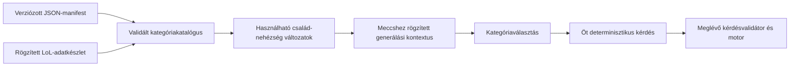

# League of Legends — kategória- és kérdésgenerálás terve

Tervezési dátum: 2026-10-10. Státusz: termékszabályok és katalógus jóváhagyva,
publikálás előtti ellenőrzések részben elkészültek; alkalmazáskód nélkül.

Alapok: a felhasználó [questionTypes.json](question-generation-input/questionTypes.json)
és [topics.json](question-generation-input/topics.json) mintái, a
[LoL-adatimport terve](lol-champion-data.md), az elfogadott
[játékszabályok](design.md) és a meglévő [kérdésprovider](backend-controller.md).
Az új [champions.json](question-generation-input/champions.json) és
[aatrox.json](question-generation-input/aatrox.json) adatokból külön
[mezőszintű forrásszerződés](lol-source-schema.md) készült.
Az elfogadott seed-, kiadásválasztási és ELO-szabályokat a
[seed- és verzióterv](question-seed-version.md) részletezi.
A JSON-ok itt tervezési referenciák; a futó alkalmazás nem tölti be őket.
Tartalmukat megőrizzük, csak a formázást igazítjuk a repóhoz. Az alábbi javítások
és kiegészítések a javasolt szerződéshez tartoznak, nem elkészült generátorhoz.
Az elfogadott szabályokból elkészült a külön
[jóváhagyott mezőszintű JSON-katalógus](question-catalog-draft/README.md):
katalógus, angol szövegek és a publikálás előtti ellenőrzések részállapota.

## 1. Értékelés és elfogadott irány

A leíró konfiguráció jó alap: külön megadható a kérdés művelete, a kategória
adatforrása, alanyai, szövege, metrikája és nehézségi szabálya. A generátor
feladata ezekből bizonyítottan helyes, megválaszolható kérdéseket készíteni.
Új név vagy százalékos határ hozzáadása nem igényel új generáló algoritmust.
Egy új adatforrás, metrika vagy művelet viszont tudatos backendbővítés.

A jelenlegi meccstéma továbbra is `league-of-legends`. A mintafájl `topics`
elemei ezen belüli kategóriacsaládok, például `skinNumber`. Egy család és egy
nehézség párosa önálló választható kategória: `skinNumber:easy` és
`skinNumber:hard` különböző kategóriák. A motor meglévő, kategóriaismétlést
tiltó szabálya ezekre az önálló változatokra vonatkozik. Ugyanaz a család
másik nehézséggel későbbi fordulóban is választható.

Minden forduló továbbra is pontosan öt kérdésből áll; egyszerre legfeljebb
négy kategória kínálható fel. Az új generátor alapból négy, nehéz kategóriánál
hat opciót készít; a pontos nehézség-hozzárendelést lent rögzítjük.
A meglévő motor a korábbi kétopciós mintakérdéseket továbbra is tudja kezelni.
Az első generátor szöveges kérdéseket és szöveges válaszopciókat készít.
A képes kérdéscsaládok megőrzött, későbbi tervek.

Az egyeztetés során elfogadott pontosítások:

- A `min`, `max`, `min2nd`, `max2nd` sorrendje a megjelenített opciók között
  értendő. A kérdés szövege is jelzi: „among these champions/skins/abilities”.
- A `multipleCorrect: false` pontosan egy helyes opciót jelent, `single` móddal.
- A `multipleCorrect: true` legalább egy helyes és legalább egy hibás opciót
  jelent, mindig `multiple` móddal. Az egyetlen helyes opció is megengedett;
  a felület nem vált át egyszeres módra a helyes opciók számából következtetve.
- A `lessThan` és `moreThan` esetében az eltérés a kérdésben szereplő
  küszöbértékhez mérendő; ahol van százalékos sáv, a helyes és hibás opciókra
  is érvényes. Challengerben nincs százalékos eltérési korlát.
- A skindarabszám az alapkinézetet és a chromákat kihagyja; a chromák
  külön metrikákban szerepelnek.
- A cooldown a képesség első rangjának alapértéke, tárgyak és rúnák nélkül.
  A megjelenítési név és szöveg `rank 1`-et használ, nem hősszintet.
- A százalékos határok inkluzívak; nulla referenciaértéket kihagyunk.
  Egyszeres kérdésnél nincs megoldási holtverseny, második helyet kérő
  típusnál minden opció metrikaértéke különbözik.
- Easy/medium esetén négy, hard/challenger esetén hat opció szerepel;
  nincs opciószám-sorsolás.
- Challengerben minden numerikus művelethez hat különböző metrikaértékű
  opció szükséges. A hat eltérő alanynév önmagában nem elegendő.
- Azonos kategóriacsalád és nehézség alatt ugyanaz a kérdés nem ismétlődik.
  Más nehézségen új opcióhalmazzal visszatérhet. Az opciók átrendezése
  önmagában nem új halmaz.
- A várószobában választható az adatbázisban elérhető játszható kiadás,
  alapból a legfrissebb. A kiadás az adatokat és a generálási szabályokat
  együtt rögzíti; tartalmi javítás külön revíziót kap.
- A seed 1–10 ASCII alfanumerikus karakter, kis-/nagybetűt megkülönböztetve.
  Alapból automatikus, de kézzel is megadható; az utóbbi az egész meccset
  kizárja a későbbi ELO-változásból.
- Azonos seed/kiadás pár azonos kategóriacsomagokat ad. A teljes meccs
  kérdéssora azonos kategóriaválasztások mellett egyezik; a választás megmarad.
- A küszöbök kerek, metrikánként rögzített lépésközű értékek: HP-nál 50,
  cooldownnál 1 másodperc, skin/chroma darabszámnál 1, támadási sebességnél 0,05,
  alap AD/armor/magic resist esetén 1, alap manánál 50, mozgási sebességnél 5,
  támadási távolságnál 25, a négy aktív növekedési paraméternél 0,2.
- A küszöbbel egyező jelöltek kimaradnak a `lessThan`/`moreThan` opcióiból.
- A kérdésszövegek teljes angol sablonokat használnak, a választási módhoz
  illő egyes/többes számmal, felismerésnél konkrét nyommal és cooldownnál `rank 1`-gyel.
- A százalékos sávok kiinduló beállítások; az adathalmaz alapján hangolhatók
  és arányosíthatók. A publikált kiadás a végleges sávokat és léptékeket őrzi meg.
- Az `attackdamageperlevel` metrika nem része az MVP kérdésgenerálásának.
  Az öt nem végleges egységű regenerációs/támadásisebesség-növekedési metrika
  szintén kimarad; a HP-/mana-/armor-/magic resist növekedés és az alap AD megmarad.
- Az MVP nem garantál minden metrikához és kategóriacsaládhoz minden
  nehézséget. Például a mozgási sebesség kimaradhat az easy statkérdésekből;
  ha a teljes család/nehézség sem tud öt különböző kérdést adni, nem kerül a kínálatba.

## 2. A csatolt katalógus feldolgozása

A két fájl érvényes JSON. A kérdéstípus-fájlban hét numerikus művelet,
egy még részletezetlen `multiSelect`, valamint a képmódosítási terv szerepel.
A kategóriafájlban 18 bejegyzés van: 10 objektummal megadott család és nyolc
`false` értékkel kikapcsolt család. A megadott nehézségekkel 31 változat
írható le; ebből 27 szöveges és négy képes. Ez konfigurációs darabszám,
nem igazoltan generálható kategóriák száma.

| Család                | Generálási feladat                                       | Nehézségek | Adatfeltétel                                                    |
| --------------------- | -------------------------------------------------------- | ---------- | --------------------------------------------------------------- |
| `baseStatsLvl1`       | Hősök alapstatjának összehasonlítása.                    | 4          | Validált stat és mértékegység; manánál erőforrástípus-szűrés.   |
| `baseStatsPerLevel`   | A forrás statnövekedési paraméterének összehasonlítása.  | 4          | A növekedési érték jelentésének és egységének rögzítése.        |
| `skinNumber`          | Hősönkénti skindarabszám, alapkinézet és chromák nélkül. | 4          | Validált `is_chroma` és `is_base` jelölés.                      |
| `chromaNumber`        | Hősönkénti chromadarabszám.                              | 4          | Tényleges, teljes chromarekordok.                               |
| `chromaPerSkin`       | Skinenkénti chromadarabszám.                             | 4          | Validált szülőskin-kapcsolat és teljes chromafelsorolás.        |
| `abilityCooldownLvl1` | Képességek első rangjának alap cooldownja.               | 4          | Validált numerikus cooldown, tárgyak és rúnák nélkül.           |
| `abilityName`         | Képességnév alapján hős felismerése.                     | easy       | A kérdésbe helyettesített képességnév és egyértelmű tulajdonos. |
| `passiveName`         | Passzív neve alapján hős felismerése.                    | easy       | A kérdésbe helyettesített passzívnév.                           |
| `title`               | Hőscím alapján hős felismerése.                          | easy       | A kérdésbe helyettesített cím.                                  |
| `abilityByIcon`       | Ikon alapján hős felismerése.                            | 4          | Későbbi médiafolyamat; az első generátorban inaktív.            |

A nyolc kikapcsolt család: `baseStatsLvlRandom`, `skinType`, `skinModified`,
`chromaType`, `abilityDamageLvlRandom`, `abilityCooldownLvlRandom`,
`abilityRange`, `tags`. A kikapcsolás megőrzi a tervezett helyüket, de nem
generál kategóriát vagy üres kérdést. A `damage` változatlanul `{}` marad.

Az eredeti két statcsalád összesen 18 metrikát sorol fel. Az elfogadott
MVP-katalógus ebből 17-et engedélyez: az `attackdamageperlevel` kimarad.
Ez metrikaszintű kizárás, nem a teljes `baseStatsPerLevel` család tiltása.
A referenciaminta és a nyers forrás megőrzése nem jelenti a metrika
aktiválását; a nullás AD-növekedés kijavítása nem az MVP indulási feltétele.

### A mintákban javítandó részletek

- `abilityByIcon` hard/challenger: az `allowedModifiactions` elírás helyesen
  `allowedModifications`. A futásidejű validátor nem fogadhatja el hallgatólagosan.
- `baseStatsPerLevel`: „Which champions gains” nyelvtanilag hibás; a végleges
  sablon a választási módhoz illő egyes/többes számot használjon.
- A felismerési kérdések jelenlegi szövegéből hiányzik a konkrét nyom.
  A „Which champion has this ability?” mellé a képességnévnek is bekerülnie
  kell, például `Which champion has the ability “{{clue}}”?`.
- Az `exactMatch` numerikus és felismerési szerepét külön kell leírni.
  A numerikus „exactly {{value}}” töredéket nem illesztjük automatikusan
  minden felismerési kérdésbe.
- Az `allowedStatTypes` jelenleg hol lista, hol szöveg, hol hiányzik.
  A végleges modell egységes metrikahivatkozásokat és külön felismerési családot használ.
- A `collection: title` a PostgreSQL-modellben a hős `title` mezőjét jelenti;
  `skins` és `chromas` ugyanazon táblából, eltérő feltétellel olvasandó.

## 3. A javasolt konfigurációs szerződés

A fájlok szerkeszthető leíró adatok maradnak. A backend induláskor vagy egy
új manifest aktiválásakor validálja és belső, egységes formára fordítja őket.
Ez a fordítás nem futtat kódot a JSON-ból, és nem enged tetszőleges SQL-t.

| Elem               | Javasolt tartalom                                                                                                                                             |
| ------------------ | ------------------------------------------------------------------------------------------------------------------------------------------------------------- |
| Manifest           | Sémaverzió, változatlan tartalomazonosító/hash, tartalomnyelv, család- és műveletdefiníciók.                                                                  |
| Kategóriacsalád    | Stabil családkulcs, állapot, megjelenítési név/fordítási kulcs, generálási család, alanytípus, sablonhivatkozások.                                            |
| Numerikus család   | Engedélyezett metrikák és nehézségenként engedélyezett műveletek, relatív eltérési határok.                                                                   |
| Felismerési család | Nyom típusa (`spellName`, `passiveName`, `championTitle`), alanytípus, identitásegyezés és kérdéssablon.                                                      |
| Metrika            | Stabil kulcs, ellenőrzött backendolvasó, jelentés, egység, értékformátum, alanyszűrés, szükséges adatkapacitás, kerek küszöblépés és metrikánkénti sávprofil. |
| Művelet            | Stabil műveletkulcs, értékelési szabály, `multipleCorrect`, megengedett generálási családok, szöveghivatkozások.                                              |
| Nehézség           | `easy`, `medium`, `hard`, `challenger`; a család engedélyezett műveletei és értéksávja.                                                                       |
| Kategóriaváltozat  | Téma + család + nehézség természetes tartalomkulcsa, megjelenítési név, rendelkezésre állás.                                                                  |

A numerikus összehasonlítás, a név/cím felismerése és a későbbi képfelismerés
külön generálási család. A `min` vagy `exactMatch` a kérdés szemantikája;
a játékmotor `single`/`multiple` mezője a válaszadás módja. Ezek külön fogalmak.
A `modifiedImage` képmegjelenítési/módosítási terv, saját szemantikai
helyességi szabályt önmagában nem ad. A `multiSelect` sincs még eléggé
definiálva: később konkrét predikátum kell hozzá, például szerepkör-tagság.

A PostgreSQL-sorok saját azonosítói továbbra is UUID-k. A kategória természetes
tartalomkulcsa a motor meglévő string `categoryId` mezőjében használható,
például `league-of-legends:skinNumber:easy`; ez nem adatbázissor-azonosító.
A megjelenített név például `Number of skins — Easy`. A nevet később
lehet fordítani a kulcs megváltoztatása nélkül.

A `collection` és a régi statnevek engedélyezett logikai hivatkozások:
`movespeed` a `move_speed`, `spellblock` a `magic_resist`, `hpperlevel`
a `hp_per_level` validált tényére fordul. Nem közvetlen táblanév vagy
SQL-oszlopnév-interpoláció. Az új metrikát külön olvasó és ellenőrzés vezeti be.

### Konfigurációvalidálás

- Ismert sémaverzió, egyedi családkulcsok, ismert művelet- és metrikahivatkozások.
- Numerikus családnál nem üres metrikalista és engedélyezett műveletlista.
- Nemnegatív, véges százalékos arányok; ha mindkét határ adott, minimum ≤ maximum.
  A `0.1` jelentése 10%, nem 0,1%.
- Csak ismert placeholder; minden szükséges változót a generálási család előállít.
  Hiányzó változóból nem lesz látható `{{placeholder}}` vagy üres kérdés.
- A sablon, alanytípus, művelet és médiaigény összhangja.
- Ismeretlen mező és elírt kulcs jelzett konfigurációhiba. A referenciahibákat
  a végleges katalógus létrehozásakor javítjuk, nem futás közben találgatjuk.

### Elfogadott kérdésszöveg-javítások

A felismerési nyom a teljes kérdés része; a sablonok például:

- `Which champion has the ability “{{clue}}”?`
- `Which champion has the passive “{{clue}}”?`
- `Which champion has the title “{{clue}}”?`

A numerikus kérdések teljes sablonjai a műveletet és az alanytípust is
figyelembe veszik. Például:

- `Which champion has the lowest {{metricLabel}} at level 1 among these champions?`
- `Which champion has the second-highest {{metricLabel}} at level 1 among these champions?`
- `Which champions have less than {{threshold}} {{metricLabel}} at level 1?`
- `Which champion has the highest {{metricLabel}} growth value among these champions?`
- `Which ability has the lowest base cooldown at rank 1 among these abilities?`

Ezek a végleges katalógushoz elfogadott szövegezési irányok; nem teljes
sablonmátrix és nem a referenciaminták helyben átírt tartalma. A metrikacímke
és az értékformátum együtt ad egyértelmű mértékegységet. A forrás növekedési
paraméterét kérdezzük, nem egy kiszámított hősszint tényleges statját.

## 4. Numerikus kérdések szabályai

### Helyes opció és relatív eltérés

`c` a helyes opció metrikaértéke; `x` egy másik opció értéke. Az eltérés:

**d(x, c) = |x − c| / |c|**

Az elfogadott határok inkluzívak. Hiányzó minimum alsó korlát nélkül, hiányzó
maximum felső korlát nélkül értendő; a művelet helyességi szabálya ettől még
kötelező. Ha mindkét határ hiányzik, nincs százalékos szűrés. Az induló
sávok átfedhetnek: 30% az easy és medium,
10% a medium és hard határán is megengedett. Ez nem konfigurációs hiba.

| Nehézség   | Elfogadott kiinduló profil          |
| ---------- | ----------------------------------- |
| easy       | Legalább 30% eltérés.               |
| medium     | 10–30% eltérés.                     |
| hard       | Legfeljebb 10% eltérés.             |
| challenger | Nincs minimum- vagy maximumeltérés. |

A challenger maximumának elhagyását a felhasználó elfogadta. A végleges
manifestben mindkét százalékos határ hiányzik ennél a nehézségnél; az
eredeti referenciaminta 5%-os maximuma nem az elfogadott MVP-szabály.
A challenger minden numerikus kérdésében hat különböző érték kell;
hatnál kevesebb használható értékkel az adott metrika nem aktiválható ezen
a nehézségen. A küszöbbel egyező opciók továbbra is kimaradnak.

Ha `c = 100`, medium esetén az alsó jelöltek 70–90, a felsők 110–130
között lehetnek. A valós adatban létező alanyokat választjuk ki ezekből;
nem találunk ki hőst vagy hamis statot. A válaszopció az alany neve, nem a
generáláshoz használt rejtett statérték. Numerikus `exactMatch` esetén a
kérdésben szerepel a célérték és az egység.

| Művelet                | Generálási szabály                                                                                                         |
| ---------------------- | -------------------------------------------------------------------------------------------------------------------------- |
| `min`                  | Egyetlen legkisebb `c`; minden hibás opció nagyobb, és teljesíti a sávot.                                                  |
| `max`                  | Egyetlen legnagyobb `c`; minden hibás opció kisebb, és teljesíti a sávot.                                                  |
| `min2nd`               | A helyes érték a második legkisebb a felkínált opciók között; pontosan egy kisebb érték és a többi nagyobb, a sávon belül. |
| `max2nd`               | A helyes érték a második legnagyobb; pontosan egy nagyobb érték és a többi kisebb, a sávon belül.                          |
| Numerikus `exactMatch` | A kérdésben megadott `c` értékkel pontosan egy opció egyezik; a többi eltér és teljesíti a sávot.                          |

Az elfogadott holtversenyszabály szerint az egyszeres kérdés megoldásánál
nem lehet holtverseny. A második helyet kérő típusokhoz minden opció különböző
metrikaértéket kap, így a „második” jelentése egyértelmű. Challengerben ez
az értékkülönbözőség minden numerikus típusra érvényes, nem csak a második
helyet kérőkre. A játékosok
rangsorolásának korábban elfogadott 1., 1., 3. szabálya külön szabály;
nem határozza meg a generált opciók rendezését.

### Küszöbös kérdések

`v` a kérdésben szereplő küszöb. A `lessThan` helyes halmaza `x < v`,
a `moreThan` helyes halmaza `x > v`. Mindkettő szigorú összehasonlítás.
Az elfogadott szabály szerint minden opcióra **d(x, v)** teljesíti a
nehézségi sávot, ha az adott profil megad sávhatárt. Challengerben nincs
százalékos szűrés, viszont hat különböző, küszöbtől eltérő érték kell,
mindkét oldalon legalább egy opcióval. Legalább egy helyes és egy hibás
opció minden nehézségen szükséges.

Az elfogadott szabály szerint a küszöb a metrika egységéhez illő kerek
érték. A lépés metrikánként külön megadható, és a kiválasztott kiadás
rögzíti. Elfogadott induló lépések:

| Metrika                                  | Küszöblépés              | Példa             |
| ---------------------------------------- | ------------------------ | ----------------- |
| Alap HP                                  | 50 HP                    | 550, 600, 650.    |
| Első képességrang cooldownja             | 1 másodperc              | 10, 11, 12 s.     |
| Skin/chroma darabszám, chroma skinenként | 1                        | 5, 6, 7.          |
| Alap támadási sebesség                   | 0,05 támadás/másodperc   | 0,60; 0,65; 0,70. |
| Alap AD és armor                         | 1 a metrika egységében   | 50, 51, 52.       |
| Alap mana                                | 50 mana                  | 250, 300, 350.    |
| Alap magic resist                        | 1 magic resist           | 30, 31, 32.       |
| Mozgási sebesség                         | 5 egység/másodperc       | 320, 325, 330.    |
| Támadási távolság                        | 25 egység                | 125, 150, 175.    |
| HP-/mana-/armor-/magic resist növekedés  | 0,2 a metrika egységében | 0,2; 0,4; 0,6.    |

A négy további ajánlott léptéket a felhasználó jóváhagyta. Új metrika
saját léptéket kap az értéktartomány és az egység alapján; nem örökli
automatikusan az 50-et. A lépés pozitív, véges és pontosan megjeleníthető.
A regeneráció és támadásisebesség-növekedés nem végleges egységű metrikái
kimaradnak az MVP-ből; a többi négy növekedési paraméter 0,2-es léptéke megmarad.

Javasolt rács: `v = k · thresholdStep`, pozitív egész `k`-val. A jelöltek
minimuma és maximuma közötti rácspontok véges listát adnak. A használhatósági
ellenőrzés csak azokat tartja meg, amelyekhez a kiadás sávjában mindkét
oldalon van jelölt, és összesen előállítható a szükséges 4/6 opció.
A megmaradt rácspontokból a seedelt stream választ stabil sorrend mellett.
Ez a `lessThan`/`moreThan` küszöbének képzése; a numerikus `exactMatch`
célértéke továbbra is valódi adatérték. A kerek küszöb nem kerekíti át az
opciók forrásstatját: a helyességet az eredeti, validált tényekből számítjuk.

Offline adatellenőrzés: a csatolt 16.20.1-es, 173 hősös lista alap HP-ja
410–696. Az 550/600/650 küszöbnél a korábbi, 5%-os challenger sávban is volt
legalább hat, küszöbtől eltérő jelölt és mindkét oldalon legalább egy.
600-nál 29 kisebb és 55 nagyobb jelölt található a sávban. Ez HP-
jelöltlefedettség, nem működő generátor vagy teljes ötös kategóriacsomag tesztje.

A küszöbértékkel egyező jelöltet az elfogadott szabály szerint kihagyjuk.
Ez a nulla eltérés külön kérdését is elkerüli; a szigorú predikátum ettől
függetlenül mindkét típusnál hamisra értékelné az egyenlőséget.

### Adatfüggő sávhangolás a kiadás előkészítésében

A felhasználó engedélyezte a százalékos eltérések módosítását és
arányosítását, ha az adathalmazhoz túl szűkek vagy túl tágak. A mintabeli
easy 30% / medium 10–30% / hard 10% kiinduló profil; a lefedettségi eredmények
alapján család-/metrikaszinten készülhet megfelelőbb profil. A challenger
elfogadott korlátmentes profiljához nem vezetünk vissza százalékos határt.

1. A teljes, validált készleten mérjük a metrika/művelet/nehézség
   használhatóságát: 4/6 opció, mindkét oldal ahol szükséges, helyeshalmaz,
   holtversenyszabály. Az öt különböző kérdés a teljes család–nehézség
   kategóriacsomagra vonatkozik, nem minden egyes metrikára vagy műveletre
   külön. Egy sikeres példa önmagában kevés.
2. A profil a kiadás előkészítésekor módosul. Arányosítási javaslatként egy
   pozitív metrikaszintű szorzó ugyanazzal az aránnyal skálázhatja az összes
   easy/medium/hard profil meglévő minimum-/maximumhatárát; a hiányzó határ hiányzó marad.
   Például 2-es szorzó: easy legalább 60%, medium 20–60%, hard legfeljebb
   20%; challenger továbbra is korlátmentes. Ez illusztráció, nem jóváhagyott új számsor.
3. A szükséges szorzót vagy egyedi határokat a teljes adatok alapján
   véglegesítjük. Az easy/medium/hard közeli opciókkal nehezítő sorrendjét
   megőrizzük; challengerben a korlátmentes választás és a hat különböző
   érték az elfogadott külön szabály. Ugyanaz a metrika a rögzített effektív profilját
   használja a kiadás minden kérdésében; runtime statisztika nem hangolja át.
4. A végleges effektív határok és küszöblépések a manifest részei, bekerülnek
   a kiadás tartalomhash-ébe. Publikálás utáni változás új revíziót igényel.
   A lefedettségi jelentés megőrzi, melyik adatkészletre ellenőriztük őket.

A hangolás mellett az inkluzív határok, a valódi forrásadatok, a nulla
referencia kihagyása és a helyes/hibás opciók szabályai továbbra is érvényesek.

### Offline sávlefedettség az eredeti profillal

2026-10-10-én a 16.20.1-es, 173 hősös `champions.json` listán a két
statcsalád mind a 18, eredeti referenciában felsorolt metrikáját ellenőriztük mind a négy
nehézségen, a mintabeli százalékos profillal. Mana-/manaregen-metrikáknál
csak a 145 `Mana` erőforrású hős szerepelt. Decimális számítással vizsgáltuk
a nulla referenciák kihagyását, az inkluzív határokat, a 4/6 opciót és a
második helyhez szükséges hat különböző értéket. Az ismert léptékekkel a
challenger küszöbös kérdések jelöltlistáit is ellenőriztük, egyenlőség nélkül.

| Eset                                      | Eredmény a mintabeli profillal                                                                                                  |
| ----------------------------------------- | ------------------------------------------------------------------------------------------------------------------------------- |
| HP, challenger, 600-as küszöb             | 29 kisebb és 55 nagyobb jelölt esik az 5%-os sávba; hat opcióhoz elegendő.                                                      |
| Mozgási sebesség, easy                    | A 315–355 tartomány legnagyobb relatív eltérése kb. 12,7%; a legalább 30%-os feltételhez egyetlen megfelelő eltérő opció sincs. |
| AD, challenger                            | A minimum/maximum/egyezés előállítható, de az 5%-os sávban egyik második helyes művelethez sincs hat különböző érték.           |
| Armor, hard                               | Minimumkérdéshez elegendő jelölt van, a második legkisebbhez nincs megfelelő hat különböző érték.                               |
| Alap HP-regeneráció, challenger           | Az 1-es küszöbrácson nincs olyan 5%-os, küszöbtől eltérő jelöltlista, amelynek mindkét oldalán lenne opció.                     |
| HP-/manaregeneráció-növekedés, challenger | A megadott műveletek egyikéhez sincs megfelelő hatopciós kérdés, a 0,2-es küszöbrácson sem.                                     |
| AD-növekedés, minden nehézség             | A csatolt listában mind a 173 érték 0; az elfogadott MVP-katalógus ezt a metrikát nem használja.                                |

A széles engedélyezett sáv önmagában nem csökkenti a jelöltek számát.
A hiányt a túl nagy minimumeltérés, a túl kicsi maximumeltérés, a
diszkrét értékkészlet vagy a holtversenytilalom okozhatja. Az egyetlen közös
skálázó sem minden metrikánál megfelelő: az easy minimumának csökkentése
javíthatja annak lefedettségét, ugyanazzal a szorzóval a hard maximuma
viszont még szűkebb lenne. Ezért szükség esetén metrikánként és
nehézségenként külön határokat hangolunk az első három nehézségnél.
Az itt mért 5%-os challenger profil korábbi referencia; az új szabály
szerinti eredményeket a következő rész tartalmazza.

Csak teljesíthető metrika/művelet párok választhatók; a második hely
szabálya nem lazul fel, és hat helyett nem készül négy opció. A referenciák
száma nem azonos az egyedi kérdésszövegek számával: a minimumkérdés új
opciókkal is ugyanaz a prompt. A családonkénti öt különböző kérdés és a
nehézségek közötti eltérő opcióhalmaz külön generátorellenőrzést igényel.

Ez a korábbi adatlefedettségi vizsgálat nem volt lefutott generátorteszt
vagy teljes kategóriacsomag. Akkor a skin/chroma- és képességcooldown-készlet
hiányzott; az Aatrox-részletből nem adtunk teljes kategóriára garanciát.
Az azóta feltöltött teljes ZIP aktuális ellenőrzését a külön
[jelentés](question-catalog-draft/publication-checks.md) tartalmazza.

Nem cél minden hiányzó kombinációt sávhangolással használhatóvá tenni.
Az MVP-ben elfogadott a metrika/nehézség párok kihagyása és egy egész
család/nehézség változat elérhetetlensége is. A lefedettségi eredmény és
a ténylegesen engedélyezett részhalmaz a kiadás előkészítésekor rögzül;
meccs közben nem lazítjuk a szabályokat egy hiányzó kérdés kedvéért.

### Offline challenger-lefedettség az elfogadott szabállyal

A korábbi, még 17 metrikás katalógust újra ellenőriztük százalékos határok nélkül, minden
numerikus műveletnél hat különböző értéket megkövetelve. A mana-erőforrású
hősökre szűrés és a nulla referencia kihagyása megmaradt.

Mind a 17 akkori metrikához volt legalább hat különböző forrásérték, és mindegyiknél
előállítható a `min`, `max`, `exactMatch`, `min2nd` és `max2nd` megfelelő
hatopciós jelöltkészlete. Például mozgási sebességnél nyolc, alap AD-nál
25, HP-regeneráció-növekedésnél 14, manaregeneráció-növekedésnél 13 különböző
érték maradt a szűrt listában. Az ismert küszöblépésű metrikák mindegyikénél
van olyan pozitív rácspont is, amelyhez hat különböző, küszöbtől eltérő
érték adható, mindkét oldalon legalább egy jelölttel. Az ismeretlen léptékű
metrikák küszöbös típusairól még nem állítunk teljesíthetőséget.

Ez a korábbi vizsgálat jelöltlefedettség volt. A jóváhagyott katalógus
mind a 16 numerikus metrikájához már a küszöblépések és a teljesíthető
családok ötös csomagjai is ellenőrizve vannak a teljes ZIP alapján,
207 seedes elemzési referenciával. A részletes
[publikálás előtti jelentés](question-catalog-draft/publication-checks.md)
elkülöníti a lefutott elemzést az elfogadott alanykizárásoktól és a leendő
generátorintegrációtól. A skinenkénti chroma hard változata nem biztosít
öt különböző promptot, ezért kimarad.

### Nulla, kerekítés és kevés jelölt

Az elfogadott szabály szerint nulla referencia-/küszöbértékre százalékos sávot nem alkalmazunk.
A generátor másik értéket, metrikát vagy engedélyezett műveletet választ;
nem oszt nullával, és nem vezet be rejtett nevezőt. A nulla adatként továbbra
is érvényes lehet, de nem azonos a hiányzó adattal. Abszolút eltérésen alapuló
profil később, külön megadott szabály lehet.

A számlálók egész értékek. Ha egy profil 12 skinhez 5%-os maximumot adna,
az csak 0,6 skin eltérést engedne, eltérő egész érték nélkül. A challenger
új profiljában ez a korlát nem szerepel; hat különböző darabszám továbbra
is szükséges. A megadott határok, a helyes opciók száma és a különbözőségi
szabály együtt is ellenőrizendő.

A statok tizedes értékeit és a sávok határait pontosan kezeljük; a kijelzett
célérték egyezzen a kiértékelttel. A végleges numerikus megoldás használhat
decimális szövegből képzett skálázott egész értékeket és keresztbeszorzást,
új számítási függőség nélkül. A lebegőpontos véletlen vagy kerekítés nem
fordíthatja meg a 10%-os határ vagy egy pontos egyezés helyességét.

## 5. Metrikák és adatminőség

### Hősök statjai

A jelenlegi mezőtérkép megtartható, egységekkel és alanyszűréssel kiegészítve.
A forrás `mp` mezője más erőforrású hősöknél nem automatikusan mana.
Mana-/mananövekedés-kérdéshez az adatadapternek külön erőforrástípust kell
szolgáltatnia, és csak mana-hősök kerülhetnek a jelöltek közé. Ezt a puszta
pozitív `mp` értékből nem lehet kikövetkeztetni.

A támadási sebesség és százalékos támadásisebesség-növekedés eltérő egységek.
A HP-/manaregeneráció szövegéhez is rögzített időegység kell. Az öt érintett
metrikát a felhasználó az MVP-ből kizárta, így egységük további tisztázása
nem blokkolja az MVP-katalógust. A forrásmezők továbbra is megőrizhetők.

A `baseStatsPerLevel` a kiválasztott `*perlevel` forrásparamétert hasonlítja
össze. Nem számolja ki a tetszőleges szintű hős tényleges statját: a LoL
növekedési képlete és egyes statok értelmezése külön feldolgozás. Elfogadott
megjelenítési név: `Base stat growth`, egyértelmű, forrásparamétert kérő
szöveggel. A `baseStatsLvlRandom` ezért továbbra is kikapcsolt.
Az `attackdamageperlevel` kivétel: a felhasználó döntése alapján nem része
az MVP engedélyezett metrikáinak, későbbi kiadásban külön aktiválható.

### Skin- és chromadarabszám

A [közös skin/chroma-modell](lol-champion-data.md) alapján:

- `skinsCount`: az adott hős `is_chroma = false` és `is_base = false`
  rekordjainak száma. Az alapkinézet és a chromák nem számítanak bele.
- `chromasCount`: az adott hős tényleges `is_chroma = true` rekordjainak száma.
- `chromasCountPerSkin`: az adott skinre mutató chromarekordok száma.
  A kérdés alanyai a szülőskinek, nem a chromák.

A [kapott Aatrox-mintában](lol-source-schema.md) a chromát a `parentSkin`
jelenléte különíti el, a `chromas` boolean a szülőskinnél true is lehet.
Ez a boolean nem másolható `is_chroma`-ba. A leképezést a felhasználó
elfogadta, és a mintát a 16.20.1-es, `en_US` Data Dragon-hősrészlet közvetlen
válaszaként azonosította. A belső számítások és a tervezett forrás így rögzítettek.

A chromadarabszám-kategóriához teljes chromafelsorolás szükséges. Egy booleanból
nem következtetünk chromadarabszámra. A forráskapacitást importkor ellenőrizzük;
hiányos felsorolásnál az érintett alany kimarad, az ismeretlen darabszám nem
lesz 0. Ha a többi alany sem ad öt érvényes kérdést, a változat nem aktiválható.
Teljes forrásban a ténylegesen nulla chroma validált 0. A teljes feltöltött ZIP
ellenőrzése elkészült; 127 false flag mellett vannak gyerekrekordok, ezekből
számolunk. Hat true jelzésű, gyerek nélküli skin és öt érintett hős összesített
chromaszáma a felhasználó döntése szerint az MVP-ből kimarad. A többi
adatuk megmarad; a [szűrés](question-catalog-draft/source-eligibility.json)
kiadáshoz kötött, alanyonként levezetendő használhatóság.

Skint tartalmazó opcióknál a hős neve és a skin neve együtt azonosítja az
elemet, hogy azonos skinnevek vagy alapkinézetnevek ne okozzanak kétértelműséget.

### Képességcooldown

Az elfogadott értelmezés a képesség első rangjának alap cooldownja, tárgyak
és rúnák nélkül. A megjelenítési név `Ability cooldowns rank 1`, a kérdés
szövege is `at rank 1`-et használ. Ez a Q/W/E/R képességek első rangjára
vonatkozik, a megfelelően feldolgozható ultimate-okat is beleértve.
A hős első szintje és az ultimate első rangja nem ugyanaz a fogalom.
Az eredeti `abilityCooldownLvl1` családkulcs a referenciamintában megmarad;
a kulcs nem módosítja az elfogadott, rang szerinti jelentést.

Az [Aatrox-minta](lol-source-schema.md) tartalmaz numerikus `cooldown` tömböt:
a validált első elem a rang 1 alapértéke. A `cooldownBurn` megjelenítési
szövegét nem alakítjuk vakon egyetlen számmá. A forrás numerikus
rangsorozatából kinyert értéket az adapter külön ellenőrzi és tárolja; a nullás
cooldown jelentését és a különleges, többformás képességek használhatóságát is
ellenőrizni kell. A ZIP húsz végig nullás tömbje az elfogadott MVP-szűrés szerint
kimarad a cooldownból, neve felismerési nyom lehet. Így 672 pozitív első-rangú
érték a forrásalap. Nem feldolgozott képesség nem kerül ebbe a jelöltlistába.
Az opció szövege például hősnév + slot + képességnév, saját stabil rekordkulccsal.

### Szöveges felismerés

A nyom a kérdésszöveg része: képességnév, passzívnév vagy hőscím.
Az opciók különböző hősök nevei. A javasolt első változat egyértelműen
egy hőshöz köthető nyomokat használ; azonos szövegű, több tulajdonosú nyomot
kihagy. Nem a numerikus „exactly” szövegtöredéket használja.

## 6. Előállítás és kategóriakínálat

A fájl nem közvetlenül a motorhoz kerül. A backend metrikaolvasói a kiválasztott
kiadás változatlan adatkészletéből validált tényeket készítenek; a generáló tiszta
függvények ezekből és a seedből dolgoznak. A szövegrenderelés és az opciósorrend
is determinisztikus. A motor továbbra is kész kérdéseket kap.

Javasolt folyamat:

1. Manifestvalidálás és fordítás; adatkapacitások, metrikák és szűrt jelöltlisták
   összeállítása. A jelöltek stabil külső kulcs szerint rendezettek.
2. Készlet + manifest párra használhatósági ellenőrzés: van-e az adott
   család/nehézség számára öt különböző, érvényes kérdés. Ehhez érték szerint
   rendezett jelöltindexek és ellenőrzött próbacsomag használható; nem a JSON
   bejegyzéseinek száma jelenti a rendelkezésre állást.
3. Új meccs előkészítésekor a várószobában kiválasztott kiadás és a tényleges
   seed egyetlen kontextusba rögzül. A kiadás már összeköti a készletet,
   manifestet, generátort és használható kategóriaváltozatokat.
   Adminfrissítés nem írja át sem ezt, sem a várószoba explicit választását.
4. A kiválasztott kategóriához pontosan öt kérdés készül. Metrika/művelet csak
   az adott nehézség engedélyezett és teljesíthető kombinációiból sorsolható.
   A választás nincs az adatbázis sor-visszaadási sorrendjére bízva.
5. A nehézségi profilhoz rögzített négy vagy hat opció készül. Nem sorsoljuk
   az opciószámot, és hat opciót igénylő profilt nem helyettesítünk néggyel.
   Elégtelen jelöltlista esetén másik teljesíthető metrika/művelet/referencia
   választandó; teljesen használhatatlan változat nem kerül a kínálatba.
6. Referencia/küszöb és opcióhalmaz képzése; helyesség a tényleges tényekből
   számítandó újra. Véges próbálkozási keret, ismétlődésellenőrzés és seedelt
   opciókeverés. Nincs korlátlan újrasorsolási ciklus.
7. A kész csomagot a motor meglévő validátora is ellenőrzi: öt kérdés, egyedi
   kérdés- és opcióazonosítók, megfelelő helyes halmaz és mód. A provider
   ezen felül ellenőrzi a generátor profiljához tartozó pontos 4/6 opciószámot.
8. Egy előkészítési retry ugyanazt a logikai csomagot reprodukálja. Az `attempt`
   nem a seed része. Az elfogadott két sikertelen próbálkozás utáni technikai
   megszakítás változatlanul alkalmazható.

A használhatósági próba nem állítja, hogy minden lehetséges seed mellett
ugyanaz a naiv próbálkozási algoritmus sikeres. A generátornak a teljesíthető
kombinációkat kell indexelnie, korlátos keresést és ellenőrzött hibakimenetet
használnia. Határidő/abort után későn elkészült csomag nem kerülhet a motorba.

Egy nehézségi változat kiadás előtt a lefedettségi vizsgálat alapján
hangolható. A publikált kiadás már rögzített határai mellett generálunk;
ha ezekkel nem áll össze öt kérdés és a teljes 4/6 opció, a változat nem
kerül az adott kiadás kínálatába. Már elindult meccs technikai hibáját a
meglévő előkészítési életciklus kezeli, nem a kategóriakatalógus önkényes cseréje.

Ez az MVP-ben elfogadott működés, nem kötelezően kijavítandó tartalomhiány.
A mozgási sebesség easy metrikapárjának kizárása például nem kapcsolja ki
az egész `baseStatsLvl1:easy` kategóriát, ha más metrikákból annak öt kérdése
előállítható. A katalógus nem követeli meg mind a négy nehézség meglétét.

### Opciószám és ismétlődés

Az elfogadott nehézség szerinti hozzárendelés:

| Nehézség   | Opciószám |
| ---------- | --------- |
| easy       | 4         |
| medium     | 4         |
| hard       | 6         |
| challenger | 6         |

Az ismétlés hatóköre az adott meccs kategóriacsalád–nehézség párja.
A kérdésazonosságot a metrika, művelet és a kérdésben látható paraméterek
adják: numerikus `exactMatch` célértéke, küszöbérték vagy felismerési nyom.
A `min`/`max`/`min2nd`/`max2nd` rejtett helyes statértéke és az opcióhalmaz
nem tesz új kérdéssé egy változatlan, azonos statra és műveletre kérdező promptot.
Így ugyanazon nehézség öt kérdése között ez a prompt nem ismétlődik.

Más nehézségen ugyanaz a prompt újra előállhat, ha az alanyok halmaza is
megváltozik. Legalább egy alany legyen eltérő; teljesen diszjunkt halmaz
nem szükséges. A puszta újrakeverés nem új halmaz, egy új technikai UUID
sem ad új alanyt. Az összevetés stabil külső alanykulcsokon alapul.

Például egy adott stat legnagyobb értékét kérő prompt szerepelhet easy
és medium alatt eltérő hősökkel. A felhasználó második legnagyobb AD-ra
adott példája az ismétlési szabályt szemlélteti: nem bővíti automatikusan
az easy/medium eredeti engedélyezett műveletlistáját.

Darabszámkategóriában az easy/medium három művelete (`min`, `max`, `exactMatch`)
mellett az öt különböző kérdéshez több, különböző célértékű `exactMatch`
szükséges. A használhatósági ellenőrzés ezt is bizonyítja, különben nem
aktiválja a változatot. A pontosan öt kérdéses szabály megmarad.

A generálás közbeni tiltóhalmaz a család kanonikus nehézségi tervében épül,
nem a játékos választási sorrendjétől függ. Így azonos seed/kiadás mellett
ugyanaz a kategória mindig ugyanazt a csomagot kapja. Egy félbeszakadt
generálás vagy retry nem fogyaszt el tartósan új kérdéseket; a korábbi
sikeres csomag újra felhasználható. A részleteket a seedterv rögzíti.

A kategóriaváltozatok a meglévő kínálati mechanizmusban külön kategóriák.
Az egyenlő kategóriánkénti esély miatt a négy nehézséget kínáló család
gyakrabban szerepelhet, mint egy csak easy család. Családonként kiegyenlített
sorsolás külön, később elfogadható szabály; nem következik automatikusan a JSON-ból.

## 7. Seed, verziózás és megőrzés

A [részletes seed- és kiadásszerződés](question-seed-version.md) rögzíti a
2026-10-10-én elfogadott termékszabályokat és a technikai javaslatot.
A kiválasztható kiadás együtt tartja változatlanul az adatot, konfigurációt
és generátort. Ez teszi tartóssá a seed + verzió garanciát.

Javasolt rögzített metadata:

| Szint      | Megőrzött adat                                                                                                                                                                       |
| ---------- | ------------------------------------------------------------------------------------------------------------------------------------------------------------------------------------ |
| Meccs      | `generation_release_id`, tényleges seed, szerver által rögzített seederedet és `custom_seed` ELO-kizárási ok. A kiadás rögzíti a készletet, manifestet és generátor-/PRNG-verziókat. |
| Forduló    | Fordulósorszám, ténylegesen választott család/nehézség kulcsa és generált tartalomhash.                                                                                              |
| Kérdésslot | A seed/kiadás/kategóriakulcsból képzett stabil sorszám és külön stream; nem kell játékosválasztást vagy teljes szöveget tárolni.                                                     |

Automatikus módban a szerver tízkarakteres seedet generál; kézi módban a
validált 1–10 karakteres szöveg marad meg. A javasolt `xoshiro128**` PRNG
kezdőállapota SHA-256-leképezésből képződik, célonként külön streammel.
`Math.random`, óraérték, új UUID, adatbázissorrend vagy közös, megváltozó
véletlenállapot nem adhat rejtett bemenetet a tartalomhoz.

A kategóriaválasztás emberi döntés, ezért a meccsseedből nem következtethető
ki. A ténylegesen kiválasztott változatokat és sorrendjüket is meg kell őrizni.
A kategóriacsomag seedbemenetéből a fordulósorszám kimarad: ugyanaz a
kategória más fordulóban is ugyanazt az öt kérdést kapja. A kínálatsorsolás
külön, fordulóhoz és korábbi választásokhoz kötött streamből dolgozik.
A kategória-/slotonkénti külön stream miatt egy előkészítési retry nem
változtatja meg a következő kérdés eredményét.
A tartalomhash a szöveget, szemantikai adatokat és stabil alanykulcsok szerinti
opciósorrendet veszi figyelembe; futás közben képzett technikai UUID-t vagy
időpontot nem. Így a visszagenerált tartalom azonosítása új meccsben is értelmes.

Az adatimportterv mellett új immutable sablonmanifest-megőrzés szükséges:
az eredeti/véglegesített leírás JSONB-ben, tartalomhash-sel és sémaverzióval,
saját UUID-val. A meccs kiadása erre is hivatkozik. Egy Git-commit azonosító önmagában
nem garantálja, hogy a futó rendszer később eléri a régi definíciókat.
Régi generátorverzióból újrajátszáshoz annak kompatibilis megvalósítását is
meg kell őrizni; ismeretlen verziót nem futtatunk csendben a legfrissebb kóddal.

Ez a metadata a hosszú távú visszagenerálhatóság alapja; felhasználói replay
képernyőt most nem vezet be. A korábban elfogadott rövid eredménymegőrzés
marad: helyesség/részpont, pontszám és végeredmény. Játékosválaszokat,
válaszidőt és teljes kérdésszövegeket továbbra sem szükséges tartósítani.
A vendégmeccs metadata nem kerül tartós historyba a korábbi szabály szerint.

## 8. Illesztés a meglévő modulokhoz

- Új generálási modul az `apps/server` workspace-ben; tiszta metrika-/művelet-/
  csomagképzési logika és külön adatbázis-/provideradapter. Új workspace nem szükséges.
- A LoL-import a tények és a nyers payload gazdája. A generátor nem indít
  saját Riot-letöltést, és nem módosít kész adatverziót.
- A `QuestionProvider` meccshez rögzített kontextussal bővül. A szinkron
  `categories(topicId)` jelenlegi globális eredménye önmagában nem elegendő
  az adat- és manifestverzió garantált rögzítéséhez. A meccsépítésnek ugyanazt
  az immutable kínálatot kell átadnia a motornak, amelyből a `prepare` dolgozik.
- A publikált kiadásokhoz tartozó katalógusok induláskor betöltődnek; az
  alapértelmezett kiadás pointere atomian frissíthető. A motor állapotmódosítási sorát
  nem tartja fel adatbázis-lekérdezés vagy generálásra várakozás.
- `/api/game-config`: választható kiadások és alapértelmezett azonosító;
  a fordulómaximum kiadásonként a ténylegesen használható kategóriákból jön.
  Üres katalógushoz explicit unavailable állapot és letiltott indítás
  kell; a jelenlegi legalább egyet váró HTTP-szerződés tudatos bővítést igényel.
- A szöveges `Question` és a publikus kérdés alapmezői elegendők. A kategória
  nehézsége a névben megjelenhet; az első generátorhoz új motorbeli pontozási
  képlet vagy külön globális difficulty lobbybeállítás nem szükséges.
- A kiadás és a seedválasztás várószobai beállítás, tulajdonosi módosítással;
  valódi változásuk törli a ready állapotokat. Ez a contracts és a
  socketprotokoll következő verzióját igényli, nem pusztán új HTML-mezőket.
- A kézi seed publikus beállítás; az automatikus tényleges seed meccs után
  megjeleníthető. A nyers statok, helyes opciók, PRNG-állapot és előkészített
  csomagok szerveroldali adatok. A snapshot-projekció csak megnyitáskor küldi a kérdést/opciókat,
  és csak lezáráskor a helyes halmazt. A countdown továbbra is kategórianévvel működik.

Az MVP megjelenítési nyelve `en`, a LoL-forráslocale `en_US`. A családnevek,
nehézségcímkék, metrikaegységek és teljes kérdéssablonok fordítási kulcsokkal
bővíthetők. Töredékek összefűzésének helyességét nem feltételezzük minden
nyelven; a szöveg nem határozza meg a kiértékelés szemantikáját.

## 9. A későbbi képes bővítés helye

Az első generátor nem aktiválja az `abilityByIcon` családot, még easy szinten
sem: az eredeti ikon is képet igényel. A `modifiedImage` és a kikapcsolt
skin/chroma képes családok leírása megmarad, megvalósítás nélkül.

A későbbi bővítéshez külön véglegesítendő:

- Kérdésmédia típusa, assetazonosítója, hozzáférése és frontendmegjelenítése.
- Asset változatlan verziója/hash-e és tartós megőrzése.
- Transformparaméterek, sorrend, seed, feldolgozóverzió és eredménycache.
- Engedélyezett kombinációk és kölcsönös kizárások. A mintában a `colorless`
  és `colorTwist` egymást kizárja; nem sorsolhatók együtt.
- A `rotate` engedélyezett értékei 90/180/270. A `blur`, `zoom`, `mirror`
  és színmódosítások részletes paraméterei még hiányoznak.
- A `modificationsCount` teljesíthetősége a kizárások mellett; feldolgozási
  határidő, cache és hibakimenet.

A későbbi médiás DTO és a socketprotokoll változását külön verziózott
szerződés kezeli. Most nem választunk képfeldolgozó csomagot vagy készítünk
megkerülő, szövegbe illesztett kép-URL megoldást.

## 10. Nyitott döntések és következő lépések

A skindarabszám és a cooldown rang-/szintértelmezése elfogadott: az alapkinézet
nem számít skinnek, a chromák külön szerepelnek; a cooldown a képesség első
rangjának alapértéke tárgyak és rúnák nélkül.

További elfogadott döntések: inkluzív sávhatárok, nulla referencia kihagyása,
holtversenymentes megoldások, easy/medium esetén négy és hard/challenger esetén hat opció,
kategória–nehézség páron belüli kérdésismétlés tiltása. Más nehézségen új
opcióhalmazzal megengedett az ismétlés.

A challenger opciószáma is hat. A `parentSkin` jelenléte alapján történő
chromaazonosítás elfogadott, a `chromas` boolean külön forrásjelzés.
Az Aatrox-minta megadott forrása a verziózott Data Dragon-végpont közvetlen válasza;
ezekhez további felhasználói pontosítás nem szükséges.

A seedformátum, az automatikus/kézi mód, a kézi seed meccsszintű ELO-kizárása,
a kategóriaválasztás megőrzése és a választható immutable kiadások külön
javítási revízióval szintén elfogadottak; a seedterv részletezi őket.

A metrikánkénti kerek küszöblépés és az adatfüggően hangolható százalékos
sáv elfogadott. HP-nál 50, cooldownnál 1 s, darabszámoknál 1, alap támadási
sebességnél 0,05, alap AD-/armor-/magic resist értéknél 1, alap manánál 50,
mozgási sebességnél 5, támadási távolságnál 25, a négy aktív növekedési
paraméternél 0,2 az induló lépték. A küszöbbel egyező jelöltek kihagyása és
a kérdésszövegek javítási iránya szintén elfogadott. A hangolt profil kiadásonként változatlan.

Az `attackdamageperlevel` MVP-beli kizárása és a nem teljesíthető
metrika-/kategória–nehézség párok kihagyása elfogadott. A challengerben
sem minimum-, sem maximumeltérés nincs. Minden challenger numerikus
kérdéshez hat különböző metrikaértékű opció kell; enélkül a metrika ezen a
nehézségen kimarad. Az öt kérdéses teljes kategóriacsomag feltétele megmarad.

A katalógus, a `Base stat growth` név és az ajánlott küszöblépések jóváhagyva.
A bizonytalan egységű `hpregen`, `mpregen`, `hpregenperlevel`,
`mpregenperlevel` és `attackspeedperlevel` az MVP-ből elhalasztva.
A korábbi AD-növekedés-kizárás megmarad; 12 aktív statmetrika maradt.

Fennmaradó technikai ellenőrzések:

- Az elemzési referenciában használt véges keresési keret és egyenletes sorsolási súlyok
  ellenőrzése a leendő natív generátorban; a teljes feltöltött készleten a referencia lefutott.
- A meglévő `xoshiro128**` tesztvektorok alkalmazásbeli megfelelősége,
  a fizikai táblák és az immutable kiadás tényleges összeállítása.

A továbblépés sorrendje:

1. A [publikálás előtti ellenőrzések](question-catalog-draft/publication-checks.md)
   forrás- és referenciarésze elkészült. A 16 metrika és három felismerési család
   vizsgálata 27 tervezett változatból 26-ot tesz elérhetővé; a hard
   skinenkénti chromakategória három prompttal kimarad.
2. A [forrásminták mezőszintű szerződésének](lol-source-schema.md) ellenőrzése
   a teljes készleten elkészült, a jóváhagyott alanykizárásokkal. Az importáló
   ugyanennek a szerződésnek a runtime validálását még implementálja.
3. Az adatimport/séma megvalósítása és referenciaminták készítése.
4. Katalógusfordító és tiszta szöveges generátor, stabil seedtesztvektorokkal.
5. Meglévő provider/meccsmentés és HTTP rendelkezésreállási szerződés illesztése.
6. Mobil és desktop kategóriaválasztó ellenőrzése, öt kérdéses teljes meccspróbák.

Tervezett érdemi ellenőrzések: placeholder- és hivatkozási hiba; a határokat
pontosító 10/30%-os esetek; nulla referencia; feltételes 5%-os sáv egész
darabszámokkal; challengerben távoli értékek elfogadása és hat különböző
érték megkövetelése minden numerikus típusnál; rendezési holtverseny;
második hely helyessége; küszöbös kérdés
egy, több és minden/egyetlen helyes nélkül; ismeretlen erőforrástípus;
az alapkinézet és chromák kizárása a skindarabszámból; hiányos chromaforrás;
az első képességrang alap cooldownja és a különleges cooldown; öt egyedi prompt;
pontos 4/6 opciószám, elégtelen hatopciós jelöltlista; azonos prompt tiltása
ugyanazon változatban és engedélyezése más nehézségen eltérő alanyhalmazzal;
pusztán kevert opciók elutasítása; azonos seedből azonos tartalom/sorrend; retry- és adatfrissítés
közben változatlan kérdések; régi manifest/generátor elérhetetlensége;
teljes meccs és helyes válaszok publikus kiszivárgásának ellenőrzése.

A csatolt JSON szintaxisát és hivatkozásait ténylegesen átnéztük. A fenti
generátorteszt-esetek még tervek; működő import vagy generátor nélkül nem
nevezhetők lefutott alkalmazásteszteknek. A korábbi 18/17 metrikás lefedettségi
vizsgálat után a jóváhagyott 12 statmetrikát az összes engedélyezett művelettel
ellenőriztük, majd a teljes ZIP-pel mind a 16 numerikus metrikát és három
felismerési családot. A teljes elemzési referencia 207 seedes, 5382 ötös
csomagos próbája 26 910 kérdésen lefutott; az ismétlődést, a helyességet és az
elfogadott alanyszűrést vizsgálta. A PRNG- és streamvektorok Pythonban és Node-ban
egyeznek. A futó TS-generátor és a kiadás-/ELO-/UI integráció tesztjei továbbra is hiányoznak.
