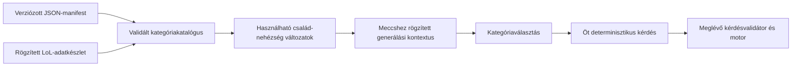

# League of Legends — kategória- és kérdésgenerálás terve

Tervezési dátum: 2026-10-09. Státusz: egyeztetés alatt, alkalmazáskód nélkül.

Alapok: a felhasználó [questionTypes.json](question-generation-input/questionTypes.json)
és [topics.json](question-generation-input/topics.json) mintái, a
[LoL-adatimport terve](lol-champion-data.md), az elfogadott
[játékszabályok](design.md) és a meglévő [kérdésprovider](backend-controller.md).
A két JSON itt tervezési referencia; a futó alkalmazás nem tölti be őket.
Tartalmukat megőrizzük, csak a formázást igazítjuk a repóhoz. Az alábbi javítások
és kiegészítések a javasolt szerződéshez tartoznak, nem elkészült generátorhoz.

## 1. Értékelés és elfogadott irány

A leíró konfiguráció jó alap: külön megadható a kérdés művelete, a kategória
adatforrása, alanyai, szövege, metrikája és nehézségi szabálya. A generátor
feladata ezekből bizonyítottan helyes, megválaszolható kérdéseket készíteni.
Új név vagy százalékos határ hozzáadása nem igényel új generáló algoritmust.
Egy új adatforrás, metrika vagy művelet viszont tudatos backendbővítés.

A jelenlegi meccstéma továbbra is `league-of-legends`. A mintafájl `topics`
elemei ezen belüli kategóriacsaládok, például `skinNumber`. Egy család és egy
nehézség párosa önálló választható kategória: `skinNumber:easy` és
`skinNumber:hard` különböző kategóriák. A motor meglévő, kategóriaismétlést
tiltó szabálya ezekre az önálló változatokra vonatkozik. Ugyanaz a család
másik nehézséggel későbbi fordulóban is választható.

Minden forduló továbbra is pontosan öt kérdésből áll; egyszerre legfeljebb
négy kategória kínálható fel. Az engedélyezett opciószámok 2, 4 és 6 maradnak.
Az első generátor szöveges kérdéseket és szöveges válaszopciókat készít.
A képes kérdéscsaládok megőrzött, későbbi tervek.

Az egyeztetés során elfogadott pontosítások:

- A `min`, `max`, `min2nd`, `max2nd` sorrendje a megjelenített opciók között
  értendő. A kérdés szövege is jelzi: „among these champions/skins/abilities”.
- A `multipleCorrect: false` pontosan egy helyes opciót jelent, `single` móddal.
- A `multipleCorrect: true` legalább egy helyes és legalább egy hibás opciót
  jelent, mindig `multiple` móddal. Az egyetlen helyes opció is megengedett;
  a felület nem vált át egyszeres módra a helyes opciók számából következtetve.
- A `lessThan` és `moreThan` esetében az eltérés a kérdésben szereplő
  küszöbértékhez mérendő, és a helyes, valamint hibás opciókra is érvényes.
- A skindarabszám az alapkinézetet és a chromákat kihagyja; a chromák
  külön metrikákban szerepelnek.
- A cooldown a képesség első rangjának alapértéke, tárgyak és rúnák nélkül.
  A megjelenítési név és szöveg `rank 1`-et használ, nem hősszintet.

## 2. A csatolt katalógus feldolgozása

A két fájl érvényes JSON. A kérdéstípus-fájlban hét numerikus művelet,
egy még részletezetlen `multiSelect`, valamint a képmódosítási terv szerepel.
A kategóriafájlban 18 bejegyzés van: 10 objektummal megadott család és nyolc
`false` értékkel kikapcsolt család. A megadott nehézségekkel 31 változat
írható le; ebből 27 szöveges és négy képes. Ez konfigurációs darabszám,
nem igazoltan generálható kategóriák száma.

| Család                | Generálási feladat                                       | Nehézségek | Adatfeltétel                                                    |
| --------------------- | -------------------------------------------------------- | ---------- | --------------------------------------------------------------- |
| `baseStatsLvl1`       | Hősök alapstatjának összehasonlítása.                    | 4          | Validált stat és mértékegység; manánál erőforrástípus-szűrés.   |
| `baseStatsPerLevel`   | A forrás statnövekedési paraméterének összehasonlítása.  | 4          | A növekedési érték jelentésének és egységének rögzítése.        |
| `skinNumber`          | Hősönkénti skindarabszám, alapkinézet és chromák nélkül. | 4          | Validált `is_chroma` és `is_base` jelölés.                      |
| `chromaNumber`        | Hősönkénti chromadarabszám.                              | 4          | Tényleges, teljes chromarekordok.                               |
| `chromaPerSkin`       | Skinenkénti chromadarabszám.                             | 4          | Validált szülőskin-kapcsolat és teljes chromafelsorolás.        |
| `abilityCooldownLvl1` | Képességek első rangjának alap cooldownja.               | 4          | Validált numerikus cooldown, tárgyak és rúnák nélkül.           |
| `abilityName`         | Képességnév alapján hős felismerése.                     | easy       | A kérdésbe helyettesített képességnév és egyértelmű tulajdonos. |
| `passiveName`         | Passzív neve alapján hős felismerése.                    | easy       | A kérdésbe helyettesített passzívnév.                           |
| `title`               | Hőscím alapján hős felismerése.                          | easy       | A kérdésbe helyettesített cím.                                  |
| `abilityByIcon`       | Ikon alapján hős felismerése.                            | 4          | Későbbi médiafolyamat; az első generátorban inaktív.            |

A nyolc kikapcsolt család: `baseStatsLvlRandom`, `skinType`, `skinModified`,
`chromaType`, `abilityDamageLvlRandom`, `abilityCooldownLvlRandom`,
`abilityRange`, `tags`. A kikapcsolás megőrzi a tervezett helyüket, de nem
generál kategóriát vagy üres kérdést. A `damage` változatlanul `{}` marad.

### A mintákban javítandó részletek

- `abilityByIcon` hard/challenger: az `allowedModifiactions` elírás helyesen
  `allowedModifications`. A futásidejű validátor nem fogadhatja el hallgatólagosan.
- `baseStatsPerLevel`: „Which champions gains” nyelvtanilag hibás; a végleges
  sablon a választási módhoz illő egyes/többes számot használjon.
- A felismerési kérdések jelenlegi szövegéből hiányzik a konkrét nyom.
  A „Which champion has this ability?” mellé a képességnévnek is bekerülnie
  kell, például `Which champion has the ability “{{clue}}”?`.
- Az `exactMatch` numerikus és felismerési szerepét külön kell leírni.
  A numerikus „exactly {{value}}” töredéket nem illesztjük automatikusan
  minden felismerési kérdésbe.
- Az `allowedStatTypes` jelenleg hol lista, hol szöveg, hol hiányzik.
  A végleges modell egységes metrikahivatkozásokat és külön felismerési családot használ.
- A `collection: title` a PostgreSQL-modellben a hős `title` mezőjét jelenti;
  `skins` és `chromas` ugyanazon táblából, eltérő feltétellel olvasandó.

## 3. A javasolt konfigurációs szerződés

A fájlok szerkeszthető leíró adatok maradnak. A backend induláskor vagy egy
új manifest aktiválásakor validálja és belső, egységes formára fordítja őket.
Ez a fordítás nem futtat kódot a JSON-ból, és nem enged tetszőleges SQL-t.

| Elem               | Javasolt tartalom                                                                                                  |
| ------------------ | ------------------------------------------------------------------------------------------------------------------ |
| Manifest           | Sémaverzió, változatlan tartalomazonosító/hash, tartalomnyelv, család- és műveletdefiníciók.                       |
| Kategóriacsalád    | Stabil családkulcs, állapot, megjelenítési név/fordítási kulcs, generálási család, alanytípus, sablonhivatkozások. |
| Numerikus család   | Engedélyezett metrikák és nehézségenként engedélyezett műveletek, relatív eltérési határok.                        |
| Felismerési család | Nyom típusa (`spellName`, `passiveName`, `championTitle`), alanytípus, identitásegyezés és kérdéssablon.           |
| Metrika            | Stabil kulcs, ellenőrzött backendolvasó, jelentés, egység, értékformátum, alanyszűrés és szükséges adatkapacitás.  |
| Művelet            | Stabil műveletkulcs, értékelési szabály, `multipleCorrect`, megengedett generálási családok, szöveghivatkozások.   |
| Nehézség           | `easy`, `medium`, `hard`, `challenger`; a család engedélyezett műveletei és értéksávja.                            |
| Kategóriaváltozat  | Téma + család + nehézség természetes tartalomkulcsa, megjelenítési név, rendelkezésre állás.                       |

A numerikus összehasonlítás, a név/cím felismerése és a későbbi képfelismerés
külön generálási család. A `min` vagy `exactMatch` a kérdés szemantikája;
a játékmotor `single`/`multiple` mezője a válaszadás módja. Ezek külön fogalmak.
A `modifiedImage` képmegjelenítési/módosítási terv, saját szemantikai
helyességi szabályt önmagában nem ad. A `multiSelect` sincs még eléggé
definiálva: később konkrét predikátum kell hozzá, például szerepkör-tagság.

A PostgreSQL-sorok saját azonosítói továbbra is UUID-k. A kategória természetes
tartalomkulcsa a motor meglévő string `categoryId` mezőjében használható,
például `league-of-legends:skinNumber:easy`; ez nem adatbázissor-azonosító.
A megjelenített név például `Number of skins — Easy`. A nevet később
lehet fordítani a kulcs megváltoztatása nélkül.

A `collection` és a régi statnevek engedélyezett logikai hivatkozások:
`movespeed` a `move_speed`, `spellblock` a `magic_resist`, `hpperlevel`
a `hp_per_level` validált tényére fordul. Nem közvetlen táblanév vagy
SQL-oszlopnév-interpoláció. Az új metrikát külön olvasó és ellenőrzés vezeti be.

### Konfigurációvalidálás

- Ismert sémaverzió, egyedi családkulcsok, ismert művelet- és metrikahivatkozások.
- Numerikus családnál nem üres metrikalista és engedélyezett műveletlista.
- Nemnegatív, véges százalékos arányok; ha mindkét határ adott, minimum ≤ maximum.
  A `0.1` jelentése 10%, nem 0,1%.
- Csak ismert placeholder; minden szükséges változót a generálási család előállít.
  Hiányzó változóból nem lesz látható `{{placeholder}}` vagy üres kérdés.
- A sablon, alanytípus, művelet és médiaigény összhangja.
- Ismeretlen mező és elírt kulcs jelzett konfigurációhiba. A referenciahibákat
  a végleges katalógus létrehozásakor javítjuk, nem futás közben találgatjuk.

## 4. Numerikus kérdések szabályai

### Helyes opció és relatív eltérés

`c` a helyes opció metrikaértéke; `x` egy másik opció értéke. Az eltérés:

**d(x, c) = |x − c| / |c|**

A javasolt határok inkluzívak. Hiányzó minimum alsó korlát nélkül, hiányzó
maximum felső korlát nélkül értendő; a művelet helyességi szabálya ettől még
kötelező. A minták szerinti sávok átfedhetnek: 30% az easy és medium,
10% a medium és hard határán is megengedett. Ez nem konfigurációs hiba.

| Nehézség   | Sáv a mintában          |
| ---------- | ----------------------- |
| easy       | Legalább 30% eltérés.   |
| medium     | 10–30% eltérés.         |
| hard       | Legfeljebb 10% eltérés. |
| challenger | Legfeljebb 5% eltérés.  |

Ha `c = 100`, medium esetén az alsó jelöltek 70–90, a felsők 110–130
között lehetnek. A valós adatban létező alanyokat választjuk ki ezekből;
nem találunk ki hőst vagy hamis statot. A válaszopció az alany neve, nem a
generáláshoz használt rejtett statérték. Numerikus `exactMatch` esetén a
kérdésben szerepel a célérték és az egység.

| Művelet                | Generálási szabály                                                                                                         |
| ---------------------- | -------------------------------------------------------------------------------------------------------------------------- |
| `min`                  | Egyetlen legkisebb `c`; minden hibás opció nagyobb, és teljesíti a sávot.                                                  |
| `max`                  | Egyetlen legnagyobb `c`; minden hibás opció kisebb, és teljesíti a sávot.                                                  |
| `min2nd`               | A helyes érték a második legkisebb a felkínált opciók között; pontosan egy kisebb érték és a többi nagyobb, a sávon belül. |
| `max2nd`               | A helyes érték a második legnagyobb; pontosan egy nagyobb érték és a többi kisebb, a sávon belül.                          |
| Numerikus `exactMatch` | A kérdésben megadott `c` értékkel pontosan egy opció egyezik; a többi eltér és teljesíti a sávot.                          |

Javaslat a holtversenyekre: az egyszeres kérdés megoldásánál nem lehet
holtverseny. A második helyet kérő típusokhoz minden opció különböző
metrikaértéket kapjon, így a „második” jelentése egyértelmű. A játékosok
rangsorolásának korábban elfogadott 1., 1., 3. szabálya külön szabály;
nem határozza meg a generált opciók rendezését.

### Küszöbös kérdések

`v` a kérdésben szereplő küszöb. A `lessThan` helyes halmaza `x < v`,
a `moreThan` helyes halmaza `x > v`. Mindkettő szigorú összehasonlítás.
Az elfogadott szabály szerint minden opcióra **d(x, v)** teljesíti a
nehézségi sávot. Legalább egy helyes és egy hibás opció szükséges.

Javaslat: a küszöböt a metrika egységéhez illő, pontosan megjeleníthető értékekből
válasszuk; nem kell feltétlenül egy konkrét hős értékével egyeznie. A generátor
egy jóváhagyott, metrikához tartozó küszöblistából vagy értéklépésből dolgozhat,
és csak olyan küszöböt használhat, amely mellett mindkét oldal összeállítható.
A küszöbértékkel egyező jelöltet az első változatban javasolt kihagyni.
Ez a nulla eltérés külön kérdését is elkerüli; a szigorú predikátum ettől
függetlenül mindkét típusnál hamisra értékelné az egyenlőséget.

### Nulla, kerekítés és kevés jelölt

Javaslat: nulla referencia-/küszöbértékre százalékos sávot nem alkalmazunk.
A generátor másik értéket, metrikát vagy engedélyezett műveletet választ;
nem oszt nullával, és nem vezet be rejtett nevezőt. A nulla adatként továbbra
is érvényes lehet, de nem azonos a hiányzó adattal. Abszolút eltérésen alapuló
profil később, külön megadott szabály lehet.

A számlálók egész értékek. Például 12 skinhez 5%-os maximum csak 0,6 skin
eltérést enged: nincs egyetlen eltérő egész érték sem. Ilyen referencia mellett
nem készülhet challenger összehasonlító kérdés. A két határ, a helyes opciók
száma és a különbözőségi szabály együtt is ellenőrizendő.

A statok tizedes értékeit és a sávok határait pontosan kezeljük; a kijelzett
célérték egyezzen a kiértékelttel. A végleges numerikus megoldás használhat
decimális szövegből képzett skálázott egész értékeket és keresztbeszorzást,
új számítási függőség nélkül. A lebegőpontos véletlen vagy kerekítés nem
fordíthatja meg a 10%-os határ vagy egy pontos egyezés helyességét.

## 5. Metrikák és adatminőség

### Hősök statjai

A jelenlegi mezőtérkép megtartható, egységekkel és alanyszűréssel kiegészítve.
A forrás `mp` mezője más erőforrású hősöknél nem automatikusan mana.
Mana-/manaregeneráció-kérdéshez az adatadapternek külön erőforrástípust kell
szolgáltatnia, és csak mana-hősök kerülhetnek a jelöltek közé. Ezt a puszta
pozitív `mp` értékből nem lehet kikövetkeztetni.

A támadási sebesség és százalékos támadásisebesség-növekedés eltérő egységek.
A HP-/manaregeneráció szövegéhez is rögzített időegység kell. Ezeket az adapter
és a metrikaleírás ellenőrzi a tényleges adatforráson.

A `baseStatsPerLevel` a kiválasztott `*perlevel` forrásparamétert hasonlítja
össze. Nem számolja ki a tetszőleges szintű hős tényleges statját: a LoL
növekedési képlete és egyes statok értelmezése külön feldolgozás. Javasolt
megjelenítési név: `Base stat growth`, egyértelmű, forrásparamétert kérő
szöveggel. A `baseStatsLvlRandom` ezért továbbra is kikapcsolt.

### Skin- és chromadarabszám

A [közös skin/chroma-modell](lol-champion-data.md) alapján:

- `skinsCount`: az adott hős `is_chroma = false` és `is_base = false`
  rekordjainak száma. Az alapkinézet és a chromák nem számítanak bele.
- `chromasCount`: az adott hős tényleges `is_chroma = true` rekordjainak száma.
- `chromasCountPerSkin`: az adott skinre mutató chromarekordok száma.
  A kérdés alanyai a szülőskinek, nem a chromák.

A chromadarabszám-kategóriához teljes chromafelsorolás szükséges. Egy booleanból
nem következtetünk chromadarabszámra. A forráskapacitást importkor ellenőrizzük;
hiányos felsorolás esetén az érintett kategóriák nem aktiválhatók, az ismeretlen
darabszám nem lesz 0. Teljes forrásban a ténylegesen nulla chroma validált 0.
A pontos külső forrásleképezés élő payloadellenőrzésre vár az adatimportterv szerint.

Skint tartalmazó opcióknál a hős neve és a skin neve együtt azonosítja az
elemet, hogy azonos skinnevek vagy alapkinézetnevek ne okozzanak kétértelműséget.

### Képességcooldown

Az elfogadott értelmezés a képesség első rangjának alap cooldownja, tárgyak
és rúnák nélkül. A megjelenítési név `Ability cooldowns rank 1`, a kérdés
szövege is `at rank 1`-et használ. Ez a Q/W/E/R képességek első rangjára
vonatkozik, a megfelelően feldolgozható ultimate-okat is beleértve.
A hős első szintje és az ultimate első rangja nem ugyanaz a fogalom.
Az eredeti `abilityCooldownLvl1` családkulcs a referenciamintában megmarad;
a kulcs nem módosítja az elfogadott, rang szerinti jelentést.

Numerikus cooldownkérdéshez validált numerikus mező kell. A `cooldownBurn`
megjelenítési szövegét nem alakítjuk vakon egyetlen számmá. A forrás numerikus
rangsorozatából kinyert értéket az adapter külön ellenőrzi és tárolja; a nullás
cooldown jelentését és a különleges, többformás képességek használhatóságát is
ellenőrizni kell. Nem feldolgozott képesség nem kerül ebbe a jelöltlistába.
Az opció szövege például hősnév + slot + képességnév, saját stabil rekordkulccsal.

### Szöveges felismerés

A nyom a kérdésszöveg része: képességnév, passzívnév vagy hőscím.
Az opciók különböző hősök nevei. A javasolt első változat egyértelműen
egy hőshöz köthető nyomokat használ; azonos szövegű, több tulajdonosú nyomot
kihagy. Nem a numerikus „exactly” szövegtöredéket használja.

## 6. Előállítás és kategóriakínálat

A fájl nem közvetlenül a motorhoz kerül. A backend metrikaolvasói az aktív,
változatlan adatkészletből validált tényeket készítenek; a generáló tiszta
függvények ezekből és a seedből dolgoznak. A szövegrenderelés és az opciósorrend
is determinisztikus. A motor továbbra is kész kérdéseket kap.

Javasolt folyamat:

1. Manifestvalidálás és fordítás; adatkapacitások, metrikák és szűrt jelöltlisták
   összeállítása. A jelöltek stabil külső kulcs szerint rendezettek.
2. Készlet + manifest párra használhatósági ellenőrzés: van-e az adott
   család/nehézség számára öt különböző, érvényes kérdés. Ehhez érték szerint
   rendezett jelöltindexek és ellenőrzött próbacsomag használható; nem a JSON
   bejegyzéseinek száma jelenti a rendelkezésre állást.
3. Új meccs előkészítésekor a készlet, manifest, generátorverzió és a használható
   kategóriaváltozatok egyetlen kontextusba rögzülnek. Egy közben végzett
   adminfrissítés a következő meccsekhez készít új kontextust.
4. A kiválasztott kategóriához pontosan öt kérdés készül. Metrika/művelet csak
   az adott nehézség engedélyezett és teljesíthető kombinációiból sorsolható.
   A választás nincs az adatbázis sor-visszaadási sorrendjére bízva.
5. Javaslat az opciószámra: az érvényes 2/4/6 méretekből seedelt sorsolás;
   `min2nd`/`max2nd` esetében minimum 4, hogy a második hely önálló kérdés
   maradjon. A nagyobb méretet el nem bíró kombinációhoz csak a kisebb,
   megengedett méretek kerülnek a sorsolásba. Ez még nem elfogadott eloszlási szabály.
6. Referencia/küszöb és opcióhalmaz képzése; helyesség a tényleges tényekből
   számítandó újra. Véges próbálkozási keret, ismétlődésellenőrzés és seedelt
   opciókeverés. Nincs korlátlan újrasorsolási ciklus.
7. A kész csomagot a motor meglévő validátora is ellenőrzi: öt kérdés, egyedi
   kérdés- és opcióazonosítók, 2/4/6 opció, megfelelő helyes halmaz és mód.
8. Egy előkészítési retry ugyanazt a logikai csomagot reprodukálja. Az `attempt`
   nem a seed része. Az elfogadott két sikertelen próbálkozás utáni technikai
   megszakítás változatlanul alkalmazható.

A használhatósági próba nem állítja, hogy minden lehetséges seed mellett
ugyanaz a naiv próbálkozási algoritmus sikeres. A generátornak a teljesíthető
kombinációkat kell indexelnie, korlátos keresést és ellenőrzött hibakimenetet
használnia. Határidő/abort után későn elkészült csomag nem kerülhet a motorba.

Ha nem áll össze egy nehézségi változat, nem lazítunk titokban a százalékokon,
nem írunk át statot és nem kínálunk fel kevesebb mint öt kérdést. A változat
nem kerül az új meccsek kínálatába. Már elindult meccs technikai hibáját a
meglévő előkészítési életciklus kezeli, nem a kategóriakatalógus önkényes cseréje.

Javaslat az ismétlődésre: az öt kérdésnek különböző jelentéssel kell bírnia;
az opciók újrakeverése önmagában nem új kérdés. A szemantikai ujjlenyomat a
családot, metrikát, műveletet, referenciát/nyomot és az opciók alanyhalmazát
veszi figyelembe. A meccsen belüli ismétlésellenőrzés a más nehézségen
újra kiválasztott családra is kiterjedhet; ennek pontos szigorúsága még nyitott.

A kategóriaváltozatok a meglévő kínálati mechanizmusban külön kategóriák.
Az egyenlő kategóriánkénti esély miatt a négy nehézséget kínáló család
gyakrabban szerepelhet, mint egy csak easy család. Családonként kiegyenlített
sorsolás külön, később elfogadható szabály; nem következik automatikusan a JSON-ból.

## 7. Seed, verziózás és megőrzés

A generálás reprodukálásához a seed mellett az adat és a konfiguráció
változatlansága is szükséges. Javasolt rögzített metadata:

| Szint      | Megőrzött adat                                                                                                                         |
| ---------- | -------------------------------------------------------------------------------------------------------------------------------------- |
| Meccs      | `question_dataset_id`, sablonmanifest UUID/hash, generátorverzió, PRNG-verzió, gyökérseed, forráslocale és kérdésnyelv.                |
| Forduló    | Fordulósorszám, ténylegesen választott család/nehézség kulcsa, determinisztikusan származtatott fordulóseed, generált tartalom hash-e. |
| Kérdésslot | A fordulóseedből képzett stabil sorszám és külön véletlenszám-folyam; nem kell játékosválasztást vagy teljes szöveget tárolni.         |

A gyökérseed szerveroldalon keletkezik. A PRNG konkrét algoritmusa és
tesztvektorai implementáció előtt rögzítendők. `Math.random`, óraérték,
új UUID, adatbázissorrend vagy megváltozó globális véletlenállapot nem adhat
rejtett bemenetet a tartalomgeneráláshoz. A meccsbeli technikai azonosítók
saját UUID-k; az újrajátszás tartalma és opciósorrendje reprodukálható új
meccsazonosítók mellett is.

A kategóriaválasztás emberi döntés, ezért a meccsseedből nem következtethető
ki. A ténylegesen kiválasztott változatokat és sorrendjüket is meg kell őrizni.
Javasolt fordulóseed-bemenet: gyökérseed, fordulósorszám és kategóriaváltozat
stabil tartalomkulcsa; új meccs-/forduló-UUID nem módosítja a tartalmat.
A forduló- és slotonkénti külön stream biztosítja, hogy egy előkészítési
újrapróbálás ne változtassa meg a következő kérdés eredményét.
A tartalomhash a szöveget, szemantikai adatokat és stabil alanykulcsok szerinti
opciósorrendet veszi figyelembe; futás közben képzett technikai UUID-t vagy
időpontot nem. Így a visszagenerált tartalom azonosítása új meccsben is értelmes.

Az adatimportterv mellett új immutable sablonmanifest-megőrzés szükséges:
az eredeti/véglegesített leírás JSONB-ben, tartalomhash-sel és sémaverzióval,
saját UUID-val. A meccs erre is hivatkozik. Egy Git-commit azonosító önmagában
nem garantálja, hogy a futó rendszer később eléri a régi definíciókat.
Régi generátorverzióból újrajátszáshoz annak kompatibilis megvalósítását is
meg kell őrizni; ismeretlen verziót nem futtatunk csendben a legfrissebb kóddal.

Ez a metadata a hosszú távú visszagenerálhatóság alapja; felhasználói replay
képernyőt most nem vezet be. A korábban elfogadott rövid eredménymegőrzés
marad: helyesség/részpont, pontszám és végeredmény. Játékosválaszokat,
válaszidőt és teljes kérdésszövegeket továbbra sem szükséges tartósítani.
A vendégmeccs metadata nem kerül tartós historyba a korábbi szabály szerint.

## 8. Illesztés a meglévő modulokhoz

- Új generálási modul az `apps/server` workspace-ben; tiszta metrika-/művelet-/
  csomagképzési logika és külön adatbázis-/provideradapter. Új workspace nem szükséges.
- A LoL-import a tények és a nyers payload gazdája. A generátor nem indít
  saját Riot-letöltést, és nem módosít kész adatverziót.
- A `QuestionProvider` meccshez rögzített kontextussal bővül. A szinkron
  `categories(topicId)` jelenlegi globális eredménye önmagában nem elegendő
  az adat- és manifestverzió garantált rögzítéséhez. A meccsépítésnek ugyanazt
  az immutable kínálatot kell átadnia a motornak, amelyből a `prepare` dolgozik.
- Az aktív készlet és manifest ellenőrzéséből származó katalógus induláskor
  betöltődik, és atomi váltással frissíthető. A motor állapotmódosítási sorát
  nem tartja fel adatbázis-lekérdezés vagy generálásra várakozás.
- `/api/game-config`: a fordulómaximum ténylegesen használható kategóriákból
  jön. Üres katalógushoz explicit unavailable állapot és letiltott indítás
  kell; a jelenlegi legalább egyet váró HTTP-szerződés tudatos bővítést igényel.
- A szöveges `Question` és a publikus kérdés alapmezői elegendők. A kategória
  nehézsége a névben megjelenhet; az első generátorhoz új motorbeli pontozási
  képlet vagy külön globális difficulty lobbybeállítás nem szükséges.
- A seed, nyers statok, helyes opciók és generálási metadata szerveroldali
  adat. A meglévő snapshot-projekció csak megnyitáskor küldi a kérdést/opciókat,
  és csak lezáráskor a helyes halmazt. A countdown továbbra is kategórianévvel működik.

Az MVP megjelenítési nyelve `en`, a LoL-forráslocale `en_US`. A családnevek,
nehézségcímkék, metrikaegységek és teljes kérdéssablonok fordítási kulcsokkal
bővíthetők. Töredékek összefűzésének helyességét nem feltételezzük minden
nyelven; a szöveg nem határozza meg a kiértékelés szemantikáját.

## 9. A későbbi képes bővítés helye

Az első generátor nem aktiválja az `abilityByIcon` családot, még easy szinten
sem: az eredeti ikon is képet igényel. A `modifiedImage` és a kikapcsolt
skin/chroma képes családok leírása megmarad, megvalósítás nélkül.

A későbbi bővítéshez külön véglegesítendő:

- Kérdésmédia típusa, assetazonosítója, hozzáférése és frontendmegjelenítése.
- Asset változatlan verziója/hash-e és tartós megőrzése.
- Transformparaméterek, sorrend, seed, feldolgozóverzió és eredménycache.
- Engedélyezett kombinációk és kölcsönös kizárások. A mintában a `colorless`
  és `colorTwist` egymást kizárja; nem sorsolhatók együtt.
- A `rotate` engedélyezett értékei 90/180/270. A `blur`, `zoom`, `mirror`
  és színmódosítások részletes paraméterei még hiányoznak.
- A `modificationsCount` teljesíthetősége a kizárások mellett; feldolgozási
  határidő, cache és hibakimenet.

A későbbi médiás DTO és a socketprotokoll változását külön verziózott
szerződés kezeli. Most nem választunk képfeldolgozó csomagot vagy készítünk
megkerülő, szövegbe illesztett kép-URL megoldást.

## 10. Nyitott döntések és következő lépések

A skindarabszám és a cooldown rang-/szintértelmezése elfogadott: az alapkinézet
nem számít skinnek, a chromák külön szerepelnek; a cooldown a képesség első
rangjának alapértéke tárgyak és rúnák nélkül.

Még nem elfogadott, ebben a tervben javasolt szabályok:

- Inkluzív sávhatárok; nulla referencia kihagyása; holtversenymentes helyes
  opció és a második helyet kérő kérdéseknél különböző statértékek.
- 2/4/6 seedelt opciószám, második helyet kérő típusnál minimum 4.
- Küszöbök metrikánkénti képzése/lépésköze és az egyenlő jelöltek kihagyása.
- Ismétlésellenőrzés szigorúsága a teljes meccsben, sorsolási súlyok és
  a véges keresési keret pontos értéke.
- A PRNG algoritmusa, verziója és a generálási metadata fizikai táblái.
- `Base stat growth` név és a metrikák pontos egységei.

A továbblépés sorrendje:

1. A fenti termékszabályok véglegesítése és a leíró JSON szerződésének jóváhagyása.
2. LoL-forráspayload ellenőrzése és az importterv metrikaigényeinek véglegesítése:
   erőforrástípus, valódi chromarekordok, validált numerikus cooldown.
3. Az adatimport/séma megvalósítása és referenciaminták készítése.
4. Katalógusfordító és tiszta szöveges generátor, stabil seedtesztvektorokkal.
5. Meglévő provider/meccsmentés és HTTP rendelkezésreállási szerződés illesztése.
6. Mobil és desktop kategóriaválasztó ellenőrzése, öt kérdéses teljes meccspróbák.

Tervezett érdemi ellenőrzések: placeholder- és hivatkozási hiba; a határokat
pontosító 10/30%-os esetek; nulla referencia; 12 skinhez tartozó lehetetlen
5%-os sáv; rendezési holtverseny; második hely helyessége; küszöbös kérdés
egy, több és minden/egyetlen helyes nélkül; ismeretlen erőforrástípus;
az alapkinézet és chromák kizárása a skindarabszámból; hiányos chromaforrás;
az első képességrang alap cooldownja és a különleges cooldown; öt egyedi kérdés; minden megengedett
opciószám; azonos seedből azonos tartalom/sorrend; retry- és adatfrissítés
közben változatlan kérdések; régi manifest/generátor elérhetetlensége;
teljes meccs és helyes válaszok publikus kiszivárgásának ellenőrzése.

A csatolt JSON szintaxisát és hivatkozásait ténylegesen átnéztük. A fenti
generátorteszt-esetek még tervek; működő import vagy generátor nélkül nem
nevezhetők lefutott teszteknek.
